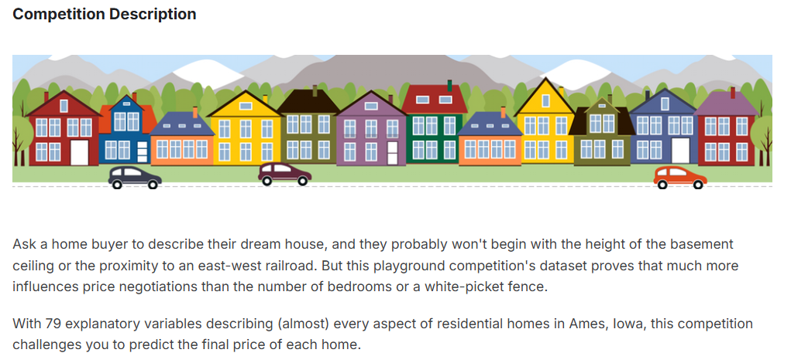
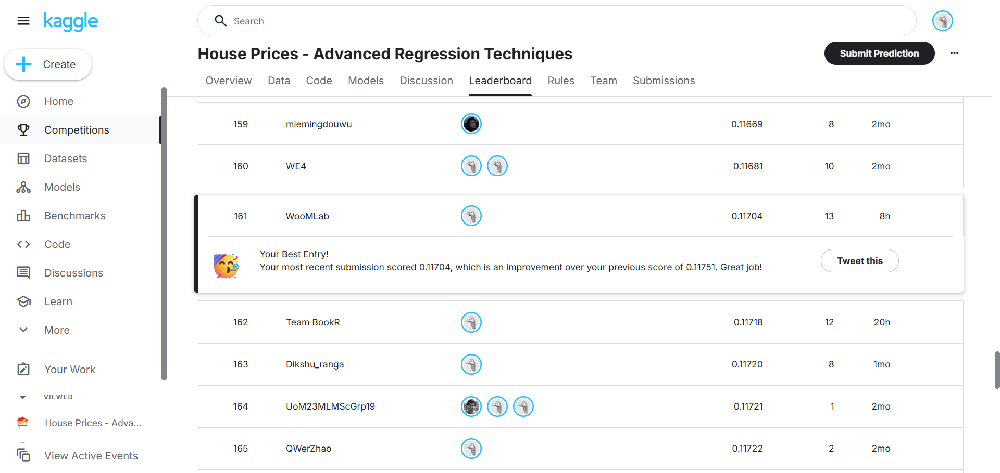

# kaggle房价预测项目总结

## 目录
1. [项目概述](#1-项目概述)
2. [环境准备与基础配置](#2-环境准备与基础配置)
3. [数据加载与初步探索](#3-数据加载与初步探索)
4. [特征工程详解](#4-特征工程详解)
5. [数据预处理技术](#5-数据预处理技术)
6. [模型训练策略](#6-模型训练策略)
7. [集成学习与模型融合](#7-集成学习与模型融合)
8. [后处理与结果优化](#8-后处理与结果优化)
9. [项目总结分析](#9-项目总结分析项目总结分析)

---

## 1. 项目概述

### 1.1 项目目标
这是一个**房价预测**项目，目标是根据房屋的各种特征（如面积、位置、建造年份等）来预测房屋的销售价格。这是一个典型的**回归问题**。

了解到这个项目的契机是在学习李沐老师的**动手学深度学习**的课程
在项目开始时还希望使用**MLP算法**（课程学习）来进行处理，虽然最后结果不好去除了（发现其在集成后那部分只占到总体预测比例的2%，因此删去该部分算法），但是最后也是利用一些机器学习的方法取得了一个个人勉强接受的成绩
该处该处项目的网址链接：https://www.kaggle.com/competitions/house-prices-advanced-regression-techniques/overview

### 1.2 整体项目设计流程
```
原始数据 → 特征工程 → 数据预处理 → 多模型训练 → 模型融合 → 后处理 → 最终预测
```

### 1.3 核心技术栈
- **LightGBM**：微软开发的梯度提升框架，速度快、精度高
- **CatBoost**：Yandex开发的梯度提升框架，擅长处理类别特征
- **集成学习**：通过组合多个模型来提高预测精度
- **Stacking**：一种高级集成技术，用另一个模型来学习如何组合基础模型

---

## 2. 环境准备与基础配置

### 2.1 导入必要的库

```python
import os, random, warnings
warnings.filterwarnings("ignore")  # 忽略警告信息，让输出更清晰
import numpy as np                 # 数值计算
import pandas as pd                # 数据处理
import torch                       # 深度学习框架（这里主要用于设置随机种子）
from sklearn.model_selection import KFold        # K折交叉验证
from sklearn.preprocessing import LabelEncoder   # 标签编码
from sklearn.linear_model import Ridge          # 岭回归
from sklearn.metrics import mean_squared_error  # 评估指标
import lightgbm as lgb            # LightGBM模型
import catboost as cb             # CatBoost模型
```

### 2.2 配置参数详解

```python
# ================= CONFIG =================
SEED = 42          # 随机种子，确保结果可重复
FOLDS = 10         # K折交叉验证的折数
DEBUG = False      # 调试模式开关
N_ESTIMATORS = 2000 if not DEBUG else 200  # 树的数量
```

**参数说明**：
- **SEED=42**：随机种子是为了确保每次运行代码得到相同的结果。42是一个常用的"幸运数字"
- **FOLDS=10**：将数据分成10份，每次用9份训练，1份验证，这样可以更充分地利用数据
- **DEBUG**：调试时设为True，可以减少树的数量，加快运行速度
- **N_ESTIMATORS**：决定模型复杂度，越多通常越准确，但训练时间也越长

### 2.3 LightGBM参数配置

```python
LGB_BASE_PARAMS = {
    'n_estimators': N_ESTIMATORS,    # 树的数量
    'learning_rate': 0.01,           # 学习率，控制每棵树的贡献
    'num_leaves': 31,                # 每棵树的叶子节点数
    'colsample_bytree': 0.4,         # 每棵树随机选择40%的特征
    'subsample': 0.8,                # 每棵树随机选择80%的样本
    'reg_alpha': 0.1,                # L1正则化系数
    'reg_lambda': 0.1,               # L2正则化系数
    'random_state': SEED,            # 随机种子
    'n_jobs': -1,                    # 使用所有CPU核心
    'verbosity': -1                  # 不输出训练过程信息
}
```

**参数调优建议**：
- **learning_rate**：通常在0.01-0.1之间，越小模型越稳定但需要更多树
- **num_leaves**：控制模型复杂度，通常是2^(max_depth)-1，但LightGBM可以直接设置
- **colsample_bytree**：防止过拟合，0.3-0.8都是常见值
- **subsample**：同样防止过拟合，0.5-0.9都可以尝试

### 2.4 模型变体策略

代码中创建了多个参数变体，这是**模型多样性**的体现：

```python
LGB_PARAM_VARIANTS = [
    {**LGB_BASE_PARAMS},  # 基础版本
    {**LGB_BASE_PARAMS, 'num_leaves': 63, 'colsample_bytree': 0.6},  # 更复杂的树
    {**LGB_BASE_PARAMS, 'num_leaves': 15, 'learning_rate': 0.02},    # 更简单但学习率更高
    # ... 更多变体
]
```

**为什么要多个变体？**
就像投资组合一样，不同的模型会在不同的数据模式上表现好，组合起来可以降低风险，提高整体性能。
事实上，在查看运行过程的输出时，能够直接观察到其中一个类别的RMSE的值相较其他大了 **700%** 左右，但是如若将其删去反而降低了最终在kaggle平台上的表现
个人目前认为是其虽然单个误差大，但是实际上令集成模型学习到了一些别的房价预测的细节

---

## 3. 数据加载与初步探索

### 3.1 数据加载

```python
train = pd.read_csv(TRAIN_PATH)
test = pd.read_csv(TEST_PATH)
train_ID = train['Id'].copy()      # 保存ID以备后用
test_ID = test['Id'].copy()
y = np.log1p(train['SalePrice'].values)  # 对目标值取对数
train.drop(['SalePrice'], axis=1, inplace=True)
```

**关键点：为什么要对价格取对数？**

假设有三个房价：50,000、200,000、1,000,000

- 原始误差：如果预测都偏差10%，误差分别是5,000、20,000、100,000
- 对数变换后：误差会更加均衡，不会因为房价高就误差特别大
- 房价右偏（长尾），取对数后更近似于**正态分布**（很神奇的一个分布），回归更稳，与Kaggle评分一致。

```python
# 示例
price = 200000
log_price = np.log1p(price)  # log1p = log(1+x)，避免log(0)
# 预测完后要转换回来（这一步千万不能忽略）
predicted_price = np.expm1(log_price)  # expm1 = exp(x)-1
```

---

## 4. 特征工程详解

特征工程是机器学习中最重要的部分之一，好的特征可以大幅提升模型性能。
在实际操作过程中，了解到想要大幅度提高在kaggle平台或者本地的运行效果，构建出非常不错的特征是不可或缺的（机器学习）。

### 4.1 创建组合特征

```python
def feature_engineer(df):
    df = df.copy()
    
    # 1. 总面积 = 地下室 + 一楼 + 二楼
    df['TotalSF'] = df.get('TotalBsmtSF',0).fillna(0) + \
                    df.get('1stFlrSF',0).fillna(0) + \
                    df.get('2ndFlrSF',0).fillna(0)
    
    # 2. 总门廊面积 = 各种门廊面积之和
    df['TotalPorchSF'] = (df.get('OpenPorchSF',0).fillna(0) + 
                          df.get('EnclosedPorch',0).fillna(0) + 
                          df.get('3SsnPorch',0).fillna(0) + 
                          df.get('ScreenPorch',0).fillna(0) + 
                          df.get('WoodDeckSF',0).fillna(0))
    
    # 3. 总浴室数 = 完整浴室 + 0.5*半浴室
    df['TotalBath'] = df.get('BsmtFullBath',0).fillna(0) + \
                      df.get('FullBath',0).fillna(0) + \
                      0.5*(df.get('BsmtHalfBath',0).fillna(0) + \
                           df.get('HalfBath',0).fillna(0))
```

**特征工程的直觉**：
- **TotalSF**：买房时我们关心的是总居住面积，而不是分别在哪一层
- **TotalBath**：半浴室功能不完整，所以权重是0.5
- **组合特征**：单个特征可能信息有限，组合后能提供更有价值的信息

### 4.2 时间相关特征

```python
df['HouseAge'] = df['YrSold'] - df['YearBuilt']        # 房龄
df['SinceRemodel'] = df['YrSold'] - df['YearRemodAdd'] # 距离上次装修的年数
```

**为什么这些特征重要？**
- 新房通常更贵（房龄小）
- 刚装修的房子也会加分（装修年数小）
- 很显然的推论

### 4.3 布尔特征

```python
df['HasPool'] = (df.get('PoolArea',0).fillna(0) > 0).astype(int)      # 是否有泳池
df['HasGarage'] = (df.get('GarageArea',0).fillna(0) > 0).astype(int)  # 是否有车库
df['HasBasement'] = (df.get('TotalBsmtSF',0).fillna(0) > 0).astype(int) # 是否有地下室
```

这些0/1特征帮助模型快速识别房屋的关键配置。
同时将其编成0/1的形式也是为了能够让计算机系统能理解处理

### 4.4 交互特征

```python
df['OverallQual_x_LivArea'] = df['OverallQual'] * df['GrLivArea']
```

**交互特征的意义**：
- 100平米的豪华装修房 vs 100平米的普通装修房，价格差异很大
- 质量×面积 能够捕捉这种交互效应
- 显然推论

---

## 5. 数据预处理技术

### 5.1 识别特征类型

```python
# 类别特征：文本类型或取值较少的整数
cat_cols = [c for c in all_df.columns if all_df[c].dtype == 'object']
for c in all_df.columns:
    if all_df[c].dtype in ['int64','int32'] and all_df[c].nunique() < 20 and c != 'Id':
        cat_cols.append(c)

# 数值特征：除了类别特征和ID之外的所有特征
exclude = set(cat_cols) | {'Id'}
num_cols = [c for c in all_df.columns if c not in exclude]
```

**为什么要区分？**
- 类别特征（如"街区名"）需要编码成数字
- 数值特征（如"面积"）可以直接使用，但可能需要标准化
- 便于后续算法处理

### 5.2 缺失值处理

```python
# 类别特征：填充为'None'
for c in cat_cols:
    all_df[c] = all_df[c].fillna('None').astype(str)

# 数值特征：填充为中位数
for c in num_cols:
    all_df[c] = all_df[c].fillna(all_df[c].median())
```

**为什么用中位数而不是平均数？**
```python
# 示例：假设有5个房子的面积
areas = [100, 120, 130, 140, 10000]  # 最后一个是异常值
mean = np.mean(areas)    # 2098 - 被异常值拉高了
median = np.median(areas) # 130 - 更稳健
```
同时缺失值的处理也是数据预处理中非常关键的一个步骤，因为你在实际的工作中无法保证你所得到的信息是自然完整的，很多时候你必然需要对其进行一定的处理转换，使得其能够被算法处理

### 5.3 偏度处理

```python
# 找出偏度大于0.8的特征
skews = all_df[num_cols].skew().abs().sort_values(ascending=False)
skewed_feats = skews[skews > 0.8].index.tolist()

# 对这些特征取对数
for c in skewed_feats:
    all_df[c] = np.log1p(all_df[c].values)
```

**什么是偏度？**
- 正偏：大部分值集中在左边，少数极大值在右边（如收入分布）
- 负偏：相反
- 对数变换可以让分布更接近正态分布，有利于模型学习

### 5.4 目标编码（Target Encoding）

这是一个高级技术，用于处理高基数类别特征（取值很多的类别）。

```python
def kfold_target_encode(train_series, target, test_series, n_splits=5, 
                       seed=SEED, min_samples_leaf=1, smoothing=10):
    # 使用K折交叉验证避免过拟合
    oof = pd.Series(np.nan, index=train_series.index)
    test_encoded = np.zeros(len(test_series))
    prior = target.mean()  # 全局均值
    
    kf = KFold(n_splits=n_splits, shuffle=True, random_state=seed)
    for tr_idx, val_idx in kf.split(train_series):
        # 在训练集上计算每个类别的目标均值
        tr_s = train_series.iloc[tr_idx]
        tr_y = target[tr_idx]
        stats = pd.DataFrame({'cat': tr_s, 'y': tr_y}).groupby('cat')['y'].agg(['mean','count'])
        
        # 平滑处理：样本少的类别更依赖全局均值
        smoothing_factor = 1 / (1 + np.exp(-(stats['count'] - min_samples_leaf) / smoothing))
        stats['te'] = prior * (1 - smoothing_factor) + stats['mean'] * smoothing_factor
        
        # 应用编码
        mapping = stats['te'].to_dict()
        oof.iloc[val_idx] = train_series.iloc[val_idx].map(mapping).fillna(prior)
        test_encoded += test_series.map(mapping).fillna(prior).values
    
    test_encoded /= n_splits
    return oof.values, test_encoded
```

**目标编码的原理示例**：

假设我们有一个"街区"特征，想知道不同街区的平均房价：

```python
# 示例数据
街区    房价(对数)
A区     11.5
A区     11.8
A区     11.6
B区     12.2
B区     12.4
C区     10.9  # C区只有一个样本

# 目标编码后
A区 → 11.63 (三个样本的均值)
B区 → 12.30 (两个样本的均值)
C区 → 11.45 (因为样本少，会向全局均值11.5靠拢)
```

**为什么要用K折？**
- 防止数据泄露：如果直接用全部数据计算均值，会导致过拟合
- K折确保编码时不使用验证集的信息

**平滑参数的作用**：
- `min_samples_leaf=1`：最少需要1个样本才计算均值
- `smoothing=10`：控制平滑的强度，值越大，样本少的类别越依赖全局均值

### 5.5 选择高基数特征进行目标编码

```python
# 选择唯一值超过10的类别特征
high_card = [c for c in cat_cols if X_train[c].nunique() > 10]
# 按唯一值数量排序，选择前6个
high_card = sorted(high_card, key=lambda x: X_train[x].nunique(), reverse=True)[:6]

for c in high_card:
    oof_te, test_te = kfold_target_encode(X_train[c], y, X_test[c], 
                                          n_splits=FOLDS, seed=SEED, 
                                          min_samples_leaf=20, smoothing=10)
    X_train[c + '_te'] = oof_te
    X_test[c + '_te'] = test_te
    num_cols.append(c + '_te')  # 添加到数值特征列表
```

---

## 6. 模型训练策略

### 6.1 LightGBM训练函数

```python
def lgb_train_oof(X, y, X_test, params, folds=FOLDS, seed=SEED):
    oof = np.zeros(len(X))  # Out-of-fold预测
    test_preds_folds = np.zeros((len(X_test), folds))  # 测试集预测
    
    kf = KFold(n_splits=folds, shuffle=True, random_state=seed)
    for i, (tr_idx, val_idx) in enumerate(kf.split(X)):
        # 分割训练集和验证集
        X_tr, X_val = X.iloc[tr_idx], X.iloc[val_idx]
        y_tr, y_val = y[tr_idx], y[val_idx]
        
        # 训练模型
        model = lgb.LGBMRegressor(**params)
        model.fit(
            X_tr, y_tr,
            eval_set=[(X_val, y_val)],
            eval_metric='rmse',
            callbacks=[lgb.early_stopping(200, verbose=False),  # 200轮没改善就停止
                      lgb.log_evaluation(period=0)]  # 不打印日志
        )
        
        # 预测
        best_iter = getattr(model, 'best_iteration_', None)
        if best_iter:
            oof[val_idx] = model.predict(X_val, num_iteration=best_iter)
            test_preds_folds[:, i] = model.predict(X_test, num_iteration=best_iter)
        else:
            oof[val_idx] = model.predict(X_val)
            test_preds_folds[:, i] = model.predict(X_test)
        
        print(f"LGB fold {i} rmse: {np.sqrt(mean_squared_error(y_val, oof[val_idx])):.6f}")
    
    return oof, test_preds_folds.mean(axis=1)
```

**关键概念解释**：

1. **Out-of-Fold (OOF) 预测**：
   ```
   假设有1000个训练样本，10折交叉验证
   第1折：用样本101-1000训练，预测样本1-100
   第2折：用样本1-100,201-1000训练，预测样本101-200
   ...
   最终每个训练样本都有一个预测值，且预测时模型没见过这个样本
   ```

2. **早停（Early Stopping）**：
   - 监控验证集性能
   - 如果200轮迭代都没有改善，就停止训练
   - 防止过拟合，节省时间

### 6.2 CatBoost训练函数

```python
def cb_train_oof(X, y, X_test, params, cat_features_indices, folds=FOLDS, seed=SEED):
    oof = np.zeros(len(X))
    test_preds_folds = np.zeros((len(X_test), folds))
    
    kf = KFold(n_splits=folds, shuffle=True, random_state=seed)
    for i, (tr_idx, val_idx) in enumerate(kf.split(X)):
        X_tr, X_val = X.iloc[tr_idx], X.iloc[val_idx]
        y_tr, y_val = y[tr_idx], y[val_idx]
        
        # CatBoost需要指定哪些是类别特征
        train_pool = cb.Pool(X_tr, y_tr, cat_features=cat_features_indices)
        val_pool = cb.Pool(X_val, y_val, cat_features=cat_features_indices)
        
        model = cb.CatBoostRegressor(**params)
        model.fit(train_pool, eval_set=val_pool, use_best_model=True, verbose=False)
        
        oof[val_idx] = model.predict(X_val)
        test_preds_folds[:, i] = model.predict(X_test)
        
        print(f"CatBoost fold {i} rmse: {np.sqrt(mean_squared_error(y_val, oof[val_idx])):.6f}")
    
    return oof, test_preds_folds.mean(axis=1)
```

**CatBoost的特点**：
- 自动处理类别特征，不需要手动编码
- 使用有序提升（Ordered Boosting）减少过拟合
- 训练速度相对较慢，但通常精度很高

### 6.3 多模型训练

```python
# 训练多个LightGBM变体
lgb_oofs, lgb_tests = [], []
for p_idx, base_params in enumerate(LGB_PARAM_VARIANTS):
    for s in LGB_SEEDS:
        params = base_params.copy()
        params['random_state'] = s
        print(f"\n--- Training LGB_v{p_idx}_s{s} (CPU) ---")
        oof, testp = lgb_train_oof(X_train[features], y, X_test[features], 
                                  params, folds=FOLDS, seed=s)
        lgb_oofs.append(oof)
        lgb_tests.append(testp)
```

**为什么训练多个模型？**
1. **参数多样性**：不同参数的模型会学到不同的模式
2. **随机种子多样性**：即使参数相同，不同种子也会产生略有差异的模型
3. **模型类型多样性**：LightGBM和CatBoost有不同的优势

---

## 7. 集成学习与模型融合

### 7.1 构建元特征矩阵

```python
# 合并所有基础模型的预测
all_oofs = lgb_oofs + cb_oofs
all_tests = lgb_tests + cb_tests
meta_train = np.column_stack(all_oofs)  # 每列是一个模型的预测
meta_test = np.column_stack(all_tests)
```

假设我们有5个模型，1000个训练样本：
```
meta_train的形状：(1000, 5)
每行代表一个样本
每列代表一个模型对该样本的预测
```

### 7.2 添加统计特征

```python
# 计算每个样本在所有模型上的统计量
stats_train = np.column_stack([
    base_preds_train.mean(axis=1),   # 平均预测
    base_preds_train.std(axis=1),    # 预测的标准差（不确定性）
    base_preds_train.min(axis=1),    # 最小预测
    base_preds_train.max(axis=1),    # 最大预测
    base_preds_train.max(axis=1) - base_preds_train.min(axis=1)  # 预测范围
])
```

**统计特征的意义**：
- **均值**：最直接的集成预测
- **标准差**：如果所有模型预测差异很大，说明这个样本比较难预测
- **最大最小值**：了解预测的范围
- **范围**：另一种衡量不确定性的方式

### 7.3 三种融合方法

#### 方法1：Ridge回归（推荐）

```python
meta_ridge = Ridge(alpha=1.0)  # alpha是正则化强度
meta_ridge.fit(meta_train_enhanced, y)
ridge_oof = meta_ridge.predict(meta_train_enhanced)
```

**Ridge回归的优势**：
- 自动学习每个模型的权重
- 正则化防止过拟合
- 可以处理模型间的相关性

#### 方法2：非负最小二乘（NNLS）

```python
from scipy.optimize import nnls
w, _ = nnls(meta_train, y)  # 权重非负约束
nnls_oof = meta_train.dot(w)
```

**NNLS的特点**：
- 权重必须≥0，更容易解释
- 适合当你认为所有模型都应该有正贡献时

#### 方法3：简单平均

```python
simple_avg_oof = meta_train.mean(axis=1)
```

**简单平均的特点**：
- 最简单，不需要训练
- 当所有模型性能相近时效果不错
- 作为baseline对比

### 7.4 选择最佳融合方法

```python
methods = {
    'Ridge': (ridge_cv_rmse, ridge_test_pred_log),
    'NNLS': (nnls_cv_rmse, nnls_test_pred_log),
    'SimpleAvg': (simple_avg_cv_rmse, simple_avg_test)
}
best_method = min(methods.keys(), key=lambda x: methods[x][0])
```
事实上，在整个项目的推进过程中，始终都是Ridge取得了最好的效果

---

## 8. 后处理与结果优化

### 8.1 自适应取整策略

```python
def adaptive_rounding(prices, oof_prices=None, oof_true=None):
    if oof_prices is not None and oof_true is not None:
        # 通过验证集找最优阈值
        best_rmse = float('inf')
        best_thresholds = None
        
        # 尝试不同的阈值组合
        t1_candidates = [80000, 90000, 100000, 110000, 120000]
        t2_candidates = [180000, 190000, 200000, 210000, 220000]
        
        for t1 in t1_candidates:
            for t2 in t2_candidates:
                rounded = oof_prices.copy()
                # 分段取整策略
                mask1 = oof_prices < t1              # 低价房：10的倍数
                mask2 = (oof_prices >= t1) & (oof_prices < t2)  # 中价房：50的倍数
                mask3 = oof_prices >= t2              # 高价房：100的倍数
                
                rounded[mask1] = np.round(rounded[mask1] / 10) * 10
                rounded[mask2] = np.round(rounded[mask2] / 50) * 50
                rounded[mask3] = np.round(rounded[mask3] / 100) * 100
                
                # 评估取整后的效果
                rmse = np.sqrt(mean_squared_error(np.log1p(oof_true), np.log1p(rounded)))
                if rmse < best_rmse:
                    best_rmse = rmse
                    best_thresholds = (t1, t2)
```

**取整策略的直觉**：
- 便宜的房子（<10万）：价格精确到10元
- 中等房子（10-20万）：价格精确到50元
- 昂贵房子（>20万）：

### 8.2 逆变换+取整+生成提交文件

```python
# 逆变换+取整
final_test_pred_float = np.expm1(final_test_pred_log)
if 'ridge_oof' in locals():
    oof_prices = np.expm1(ridge_oof)
    oof_true = np.expm1(y)
    final_test_pred = adaptive_rounding(final_test_pred_float, oof_prices, oof_true)
else:
    final_test_pred = (np.round(final_test_pred_float / 10) * 10).astype(int)
print("\nPost-processing: 自适应取整已应用")
# 生成提交文件
sub = pd.DataFrame({'Id': test_ID, 'SalePrice': final_test_pred})
sub.to_csv('submission.csv', index=False)
print("已保存 submission.csv")
print("\n预测样本示例:")
print(sub.head())
```

最终便是将预测结果汇总并重新归于整数，并以符合要求的形式上传

---

## 9. 项目总结分析

### 9.1 项目成绩分析

项目在kaggle平台上的成绩变化如下
```
0.12357->0.12357->0.12513->0.12283->0.12412->0.12333->0.12333->0.12218->0.12198->0.12067->0.11751->0.11856->0.11704
```
整个过程可以说是螺旋式发展，并在波动中上升
最终成绩在2025年8月14日排名为**161/4388**，取得了整个项目**前4%**的不错成绩

### 9.2 项目流程图

```
CSV 读取 → 目标取对数 y=log1p → 手工特征工程
     ↓
合并 train/test → 缺失填充（类别=‘None’，数值=中位数）
     ↓
数值列查偏度 |skew|>0.8 → 对这些列 log1p
     ↓
Label Encoding（类别→整数），并保留类别列清单
     ↓
高基数类别做 KFold Target Encoding（防泄漏），追加 _te 列
     ↓
K 折训练一堆 LGB/CB 变体（含不同种子）→ 得到 OOF 与 test 预测
     ↓
把所有 OOF 拼成 meta_train（+统计特征），test 同理
     ↓
Ridge / NNLS / 简单平均（三选一）学融合权重
     ↓
对 test 的 log 预测做 expm1 → 自适应取整 → 导出 CSV
```

### 9.3 项目完结感想

在项目开始初期，本人注意到在kaggle的平台上，有一大部分极低分数，通过查阅相关资料发现其存在寻找**别的数据集**来比对打表的情况，固然能高分，但是在我看来失去了本身项目模型实现的意义

项目整个完成的过程诚然借助了目前当下火热而又炸爽的语言大模型，例如chatgpt、claude等等。实际上这个过程的初始常常让我思考个人在项目实现过程的作用是否仅仅局限于提供**prompt**？
经过思考后在当下得出以下结论

+ 大模型带给个人的往往是效率上的极大提高，一些基于框架的内容，在当下大模型的工作之下，可以说是水到渠成
+ 这个过程必然需要谨慎思考AI带给你的一些弊端->在我目前看来，便是思维惰性，非常**严重的思维惰性**，有时候甚至会生出一种类似于随缘试试看的想法，需要自驱力去客服这个思维
+ 在实现项目的过程中，主流的大模型并没有察觉到价格上的一些特征（例如整数）等等，是在个人经过调试等过程后得出的答案，这再一次令人明白**模型只是工具**的核心观点
+ 事实上，每当望着几百行ai生成的代码，总是会令我想起李沐老师在课程中十行代码实现的效果，令人总是能产生一些异样而又奇怪的感想

最后，希望自己能够坚持学习、不断进步 **GAINS DONT STOP**