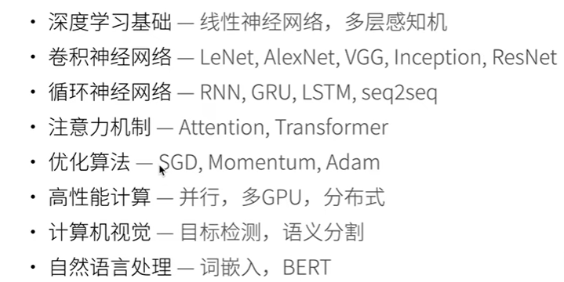
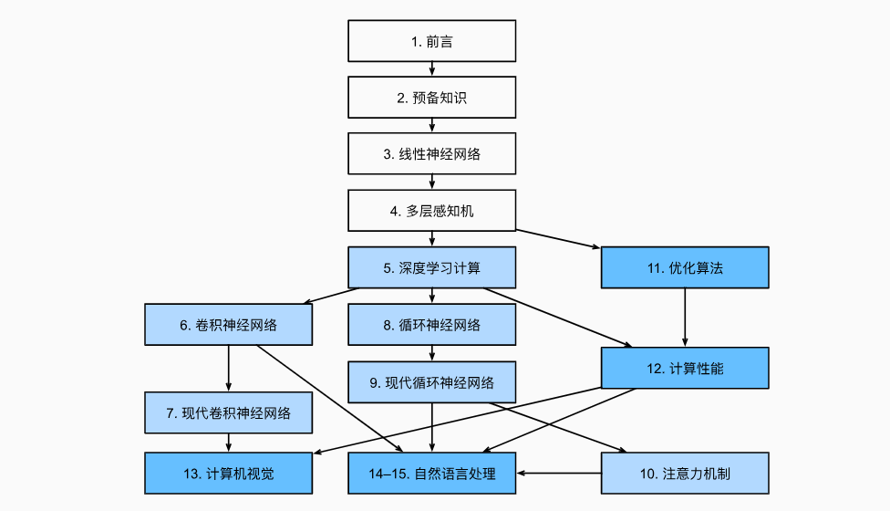
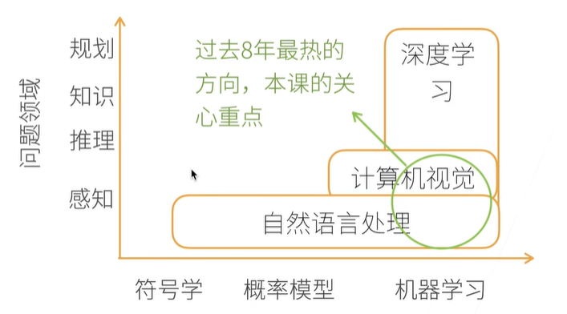
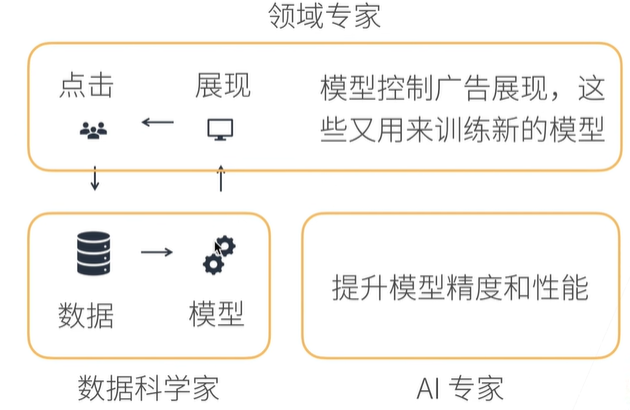
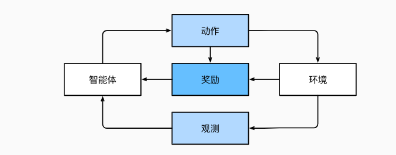
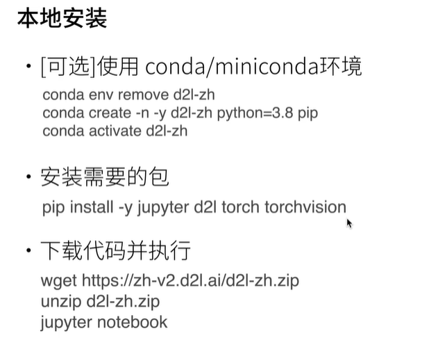
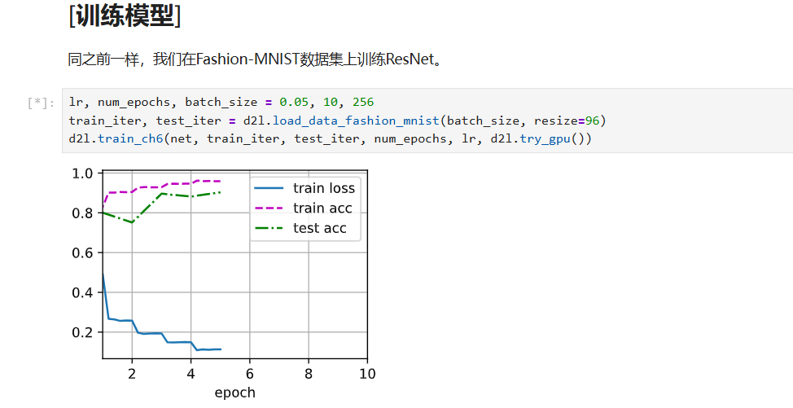

# 动手学深度学习笔记v2 李沐（00-03）
本系列将根据李沐老师发布的动手学深度学习课程，撰写一份便于自身回忆的学习笔记
课程链接如下：https://space.bilibili.com/1567748478/lists/358497?type=series
## 00 预告
### 网课内容
学习深度学习的关键在于**动手**
+ 核心在于神经网络
+ 神经网络是一门语言，应该像学习python/C++一样学习深度学习
+ 教科书网址：https://zh-v2.d2l.ai/
### 个人感受
开篇预告仅仅起到引子作用，简明扼要地描述了课程对应的内容。
对于其中 _**神经网络是一门语言，应该像学习python/C++一样学习深度学习**_ 产生了一定的好奇想法，并希望能够在后续学习中得到解惑。
## 01 课程安排
### 网课内容
课程目标

+ 介绍深度学习经典和最新模型
  + LeNet，ResNet,LSTM,BERT,...
+ 机器学习基础
  + 损失函数，目标函数，过拟合，优化
+ 实践
  + 使用Pytorch实现介绍的知识点
  + 在真实数据上体验算法效果

课程内容介绍如下图：

学到什么
+ **What**
  - 深度学习里有哪些技术
+ **How**
  - 如何实现和调参
+ **Why**
  - 背后的原因（直觉、数学）
  
配套教材的结构

### 个人感受
What、How、Why三个提问，引导个人学习深度学习中应该思考的大方向和内容，对整体框架脉络有了更深入的认识。
## 02 深度学习介绍
### 网课内容
AI地图

一些应用：图片分类、物体检测和分割、样式迁移、人脸合成、文字生成图片、文字生成、无人驾驶
案例研究-广告点击
触发->点击率估计->排序
完整的故事

有效性和可解释性（黑盒）
### 教材内容
机器学习是一类强大的可以从经验中学习的技术。通常采用观测数据或与环境交互的形式，机器学习算法会积累更多的经验，其性能也会逐步提高。
深度学习是一套强大的技术，它可以推动计算机视觉、自然语言处理、医疗保健和基因组学等不同领域的创新。
#### 日常生活中的机器学习
那么到底什么是参数呢？ 参数可以被看作旋钮，旋钮的转动可以调整程序的行为。
任一调整参数后的程序被称为模型（model）。
通过操作参数而生成的所有不同程序（输入-输出映射）的集合称为“模型族”。
使用数据集来选择参数的元程序被称为学习算法（learning algorithm）
训练过程通常包含如下步骤：
1. 从一个随机初始化参数的模型开始，这个模型基本没有“智能”；
2. 获取一些数据样本（例如，音频片段以及对应的是或否标签）；
3. 调整参数，使模型在这些样本中表现得更好；
4. 重复第（2）步和第（3）步，直到模型在任务中的表现令人满意。

一个典型的训练过程的流程图如下图所示：

这种“通过用数据集来确定程序行为”的方法可以被看作用数据编程（programming with data）。
#### 机器学习中的关键组件
无论什么类型的机器学习问题，都会遇到这些组件：
+ 可以用来学习的**数据（data）**；
+ 如何转换数据的**模型（model）**；
+ 一个**目标函数（objective function）**，用来量化模型的有效性；
+ 调整模型参数以优化目标函数的**算法（algorithm）**。
##### 数据
每个数据集由一个个样本（example, sample）组成，大多时候，它们遵循**独立同分布(independently and identically distributed, i.i.d.)**。
样本有时也叫做数据点（data point）或者数据实例（data instance），通常每个样本由一组称为特征（features，或协变量（covariates））的属性组成。 
机器学习模型会根据这些属性进行预测。 在上面的监督学习问题中，要预测的是一个特殊的属性，它被称为标签（label，或目标（target））。
当每个样本的特征类别数量都是相同的时候，其特征向量是固定长度的，这个长度被称为数据的维数（dimensionality）。
更多的数据可以被用来训练出更强大的模型，从而减少对预先设想假设的依赖。 数据集的由小变大为现代深度学习的成功奠定基础。在没有大数据集的情况下，许多令人兴奋的深度学习模型黯然失色。 _就算一些深度学习模型在小数据集上能够工作，但其效能并不比传统方法高。_
仅仅拥有海量的数据是不够的，我们还需要**正确的数据**
##### 模型
深度学习与经典方法的区别主要在于：前者关注的功能强大的模型，这些模型由神经网络错综复杂的交织在一起，包含层层数据转换，因此被称为深度学习（deep learning）。 
##### 目标函数
在机器学习中，我们需要定义模型的优劣程度的度量，这个度量在大多数情况是“可优化”的，这被称之为目标函数（objective function）。 
我们通常定义一个目标函数，并希望优化它到最低点。 因为越低越好，所以这些函数有时被称为损失函数（loss function，或cost function）。
可用数据集通常可以分成两部分：训练数据集用于拟合模型参数，测试数据集用于评估拟合的模型。
当一个模型在训练集上表现良好，但不能推广到测试集时，这个模型被称为过拟合（overfitting）的。
##### 优化目标
深度学习中，大多流行的优化算法通常基于一种基本方法–梯度下降。
#### 机器学习中的常见问题
**监督学习、无监督学习、与环境互动、强化学习**
##### 监督学习
监督学习（supervised learning）擅长在“给定输入特征”的情况下预测标签。
监督学习的学习过程一般可以分为三大步骤：
1. 从已知大量数据样本中随机选取一个子集，为每个样本获取真实标签。有时，这些样本已有标签（例如，患者是否在下一年内康复？）；有时，这些样本可能需要被人工标记（例如，图像分类）。这些输入和相应的标签一起构成了训练数据集；
2. 选择有监督的学习算法，它将训练数据集作为输入，并输出一个“已完成学习的模型”；
3. 将之前没有见过的样本特征放到这个“已完成学习的模型”中，使用模型的输出作为相应标签的预测。

监督学习流程图如下所示。

监督学习的一些任务
+ 回归：当标签取任意数值时，我们称之为回归问题，此时的目标是生成一个模型，使它的预测非常接近实际标签值。
+ 分类：训练一个分类器来输出预测的类别
+ 标记问题：学习预测不相互排斥的类别的问题称为多标签分类（multi-label classification）
+ 搜索：搜索引擎使用机器学习和用户行为模型来获取网页相关性得分，很多学术会议也致力于这一主题
+ 推荐系统：另一类与搜索和排名相关的问题是推荐系统（recommender system），它的目标是向特定用户进行“个性化”推荐
+ 序列学习： 序列学习需要摄取输入序列或预测输出序列，或两者兼而有之。 具体来说，输入和输出都是可变长度的序列，例如机器翻译和从语音中转录文本。虽然不可能考虑所有类型的序列转换，但以下特殊情况值得一提。
  + 标记和解析：输入和输出的数量基本上是相同的
  + 自动语音识别：输入序列是说话人的录音（如 图1.3.5 所示），输出序列是说话人所说内容的文本记录
  + 文本到语音：输入是文本，输出是音频文件
  + 机器翻译：颠倒输入和输出的顺序非常重要
##### 无监督学习
这类数据中不含有“目标”的机器学习问题通常被为无监督学习（unsupervised learning）
无监督学习可以回答什么样的问题
+ 聚类（clustering）问题：没有标签的情况下，我们是否能给数据分类呢？比如，给定一组照片，我们能把它们分成风景照片、狗、婴儿、猫和山峰的照片吗？同样，给定一组用户的网页浏览记录，我们能否将具有相似行为的用户聚类呢？
+ 主成分分析（principal component analysis）问题：我们能否找到少量的参数来准确地捕捉数据的线性相关属性？比如，一个球的运动轨迹可以用球的速度、直径和质量来描述。再比如，裁缝们已经开发出了一小部分参数，这些参数相当准确地描述了人体的形状，以适应衣服的需要。另一个例子：在欧几里得空间中是否存在一种（任意结构的）对象的表示，使其符号属性能够很好地匹配?这可以用来描述实体及其关系，例如“罗马”-“意大利”+“法国”= “巴黎”。
+ 因果关系（causality）和概率图模型（probabilistic graphical models）问题：我们能否描述观察到的许多数据的根本原因？例如，如果我们有关于房价、污染、犯罪、地理位置、教育和工资的人口统计数据，我们能否简单地根据经验数据发现它们之间的关系？
+ 生成对抗性网络（generative adversarial networks）：为我们提供一种合成数据的方法，甚至像图像和音频这样复杂的非结构化数据。潜在的统计机制是检查真实和虚假数据是否相同的测试，它是无监督学习的另一个重要而令人兴奋的领域。
##### 与环境互动
到目前为止，不管是监督学习还是无监督学习，我们都会预先获取大量数据，然后启动模型，不再与环境交互。这里所有学习都是在算法与环境断开后进行的，被称为离线学习（offline learning）
与预测不同，“与真实环境互动”实际上会影响环境。 这里的人工智能是“智能代理”，而不仅是“预测模型”。
因此，我们必须考虑到它的行为可能会影响未来的观察结果。
##### 强化学习
如果你对使用机器学习开发与环境交互并采取行动感兴趣，那么最终可能会专注于强化学习
在强化学习问题中，智能体（agent）在一系列的时间步骤上与环境交互。 在每个特定时间点，智能体从环境接收一些观察（observation），并且必须选择一个动作（action），然后通过某种机制（有时称为执行器）将其传输回环境，最后智能体从环境中获得奖励（reward）。 此后新一轮循环开始，智能体接收后续观察，并选择后续操作，依此类推。
强化学习的过程如下图所示

强化学习的目标是产生一个好的策略（policy）。 
强化学习智能体选择的“动作”受策略控制，即一个从环境观察映射到行动的功能。
因此，强化学习者必须处理学分分配（credit assignment）问题：决定哪些行为是值得奖励的，哪些行为是需要惩罚的。
强化学习智能体必须不断地做出选择：是应该利用当前最好的策略，还是探索新的策略空间（放弃一些短期回报来换取知识）
当环境可被完全观察到时，强化学习问题被称为马尔可夫决策过程（markov decision process）。 
当状态不依赖于之前的操作时，我们称该问题为上下文赌博机（contextual bandit problem）。 
当没有状态，只有一组最初未知回报的可用动作时，这个问题就是经典的多臂赌博机（multi-armed bandit problem）。
#### 起源
克劳德·香农(1916–2001)的信息论和艾伦·图灵（1912-1954）的计算理论。
图灵在他著名的论文《计算机器与智能》 (Turing, 1950) 中提出了“机器能思考吗？”的问题。在他所描述的图灵测试中，如果人类评估者很难根据文本互动区分机器和人类的回答，那么机器就可以被认为是“智能的”
#### 深度学习的发展
算上看起来不可行的神经网络算法变得热门起来，实际上是以下两点导致的：其一，随着互联网的公司的出现，为数亿在线用户提供服务，大规模数据集变得触手可及；另外，廉价又高质量的传感器、廉价的数据存储（克莱德定律）以及廉价计算（摩尔定律）的普及，特别是GPU的普及，使大规模算力唾手可得。
算力的增长速度已经超过了现有数据的增长速度。这意味着统计模型需要提高内存效率（这通常是通过添加非线性来实现的），同时由于计算预算的增加，能够花费更多时间来优化这些参数。
#### 深度学习的成功案例
人工智能系统是以一种特定的、面向目标的方式设计、训练和部署的。
其次，目前还不存在能够自我改进、自我推理、能够在试图解决一般任务的同时，修改、扩展和改进自己的架构的“人工通用智能”工具。
#### 特点
毋庸置疑，深度学习方法中最显著的共同点是使用端到端训练。也就是说，与其基于单独调整的组件组装系统，不如构建系统，然后联合调整它们的性能。例如，在计算机视觉中，科学家们习惯于将特征工程的过程与建立机器学习模型的过程分开。
深度学习的一个关键优势是它不仅取代了传统学习管道末端的浅层模型，而且还取代了劳动密集型的特征工程过程。
#### 小结
+ 机器学习研究计算机系统如何利用**经验（通常是数据）**来提高特定任务的性能。它结合了统计学、数据挖掘和优化的思想。通常，它是被用作实现人工智能解决方案的一种手段。
+ 表示学习作为机器学习的一类，其研究的重点是如何自动找到合适的数据表示方式。深度学习是通过学习多层次的转换来进行的多层次的表示学习。
+ 深度学习不仅取代了传统机器学习的浅层模型，而且取代了劳动密集型的特征工程。
+ 最近在深度学习方面取得的许多进展，大都是由廉价传感器和互联网规模应用所产生的大量数据，以及（通过GPU）算力的突破来触发的。
+ 整个系统优化是获得高性能的关键环节。有效的深度学习框架的开源使得这一点的设计和实现变得非常容易。
### 个人感受
此处两部分内容，故分两部分进行个人感受的描述：
+ 网课内容部分对整体的深度学习的应用领域和场景及进行了初步的介绍，同时说明其广泛的应用领域和在其领域中起到的助推作用。
+ 课本部分从机器学习列举起，在介绍了机器学习领域一些基本术语的基础上，引入了深度学习，增加对该领域一些基本的认识。任何技术都有其各自的局限性，合适才是更为重要的。同时技术的发展往往是复合的，而非仅仅由于自身技术的突破， _**最近在深度学习方面取得的许多进展，大都是由廉价传感器和互联网规模应用所产生的大量数据，以及（通过GPU）算力的突破来触发的。**_
## 03 安装
### 网课内容
动手实践->加深理解与记忆
本地安装方式和内容可以自行参考和修正，下方给出网课中的配置方案（该方案是基于Ubuntu系统）

本人最终采取windows系统下使用miniconda进行环境配置，使用设备配置如下所示：

此处给出李沐老师制作的Windows系统下的配置方案的教程参考链接：
https://www.bilibili.com/video/BV18K411w7Vs?share_source=copy_web&spm_id_from=333.788.videopod.sections&vd_source=839b8bf66b27da8765d28ed46d468ecb
同时，由于之前已经配置过一些其他的内容方案，因此本地方案采取下方的配置方案
Python 3.10.12 和 PyTorch 2.5.1+cu121
最终运行结果如下所示

### 个人感受
项目开始第一步便是配置环境，配置过程中遇到的问题仍然是需要个人去理解客服的。
看起来简单的过程往往只有实践过后才能明白其中曲折。