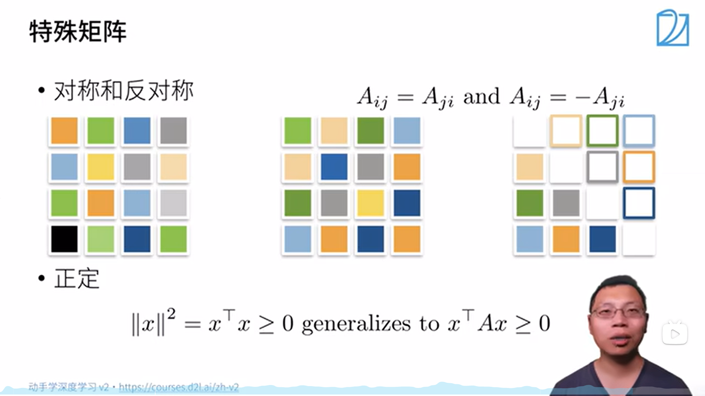

# 动手学深度学习笔记v2 李沐（04-07）
本系列将根据李沐老师发布的动手学深度学习课程，撰写一份便于自身回忆的学习笔记
课程链接如下：https://space.bilibili.com/1567748478/lists/358497?type=series
教科书网址：https://zh-v2.d2l.ai/
## 04 数据操作+数据预处理
### 网课内容
#### 数据操作
N维数组是机器学习和神经网络的主要数据结构

创建数组需要：

+ **形状**：例如3*4矩阵
+ 每个元素的**数据类型**：例如32位浮点数
+ 每个元素的**值**，例如全是0，或者随机数

访问数据示例如下图所示（注意右上角一列图应为[:,1]）

#### 数据操作实践
导入torch而非pytorch
张量表示一个数值组成的数组，这个数组可能有多个维度
可以通过张量的shape属性来访问张量的形状和张量中元素的总数（x.shape,x.numel）
要改变一个张量的形状而不改变元素数量和元素值，可以调用reshape函数
可以注意通过嵌套列表的层数（即元素需要多少层索引才能访问到标量）来判断维度
常见的标准算术符（+-*/）按元素进行
即使形状不同，依然可以通过广播机制来进行执行按元素操作
运行一些操作可能会为新结果分配内存
可以转换为NumPy
#### 数据预处理
处理缺失数据的过程典型的方法有**插值**和**删除**操作
### 教材内容
深度学习是关于*优化*的学习。 对于一个带有参数的模型，我们想要找到其中能拟合数据的最好模型。
#### 数据操作
通常，我们需要做两件重要的事：（1）获取数据；（2）将数据读入计算机后对其进行处理。
首先，我们介绍n维数组，也称为**张量（tensor）**。 
无论使用哪个深度学习框架，它的张量类（在MXNet中为ndarray， 在PyTorch和TensorFlow中为Tensor）都与Numpy的ndarray类似。但深度学习框架又比Numpy的ndarray多一些重要功能：首先，GPU很好地支持**加速计算**，而NumPy仅支持CPU计算；其次，张量类支持**自动微分**。 
张量表示一个由数值组成的数组，这个数组可能有多个维度。具有一个轴的张量对应数学上的向量（vector）；具有两个轴的张量对应数学上的矩阵（matrix）；具有两个轴以上的张量没有特殊的数学名称。
张量中的每个值都称为张量的元素（element）
除非额外指定，新的张量将存储在内存中，并采用基于CPU的计算
可以通过张量的shape属性来访问张量（沿每个轴的长度）的形状
如果只想知道张量中元素的总数，即形状的所有元素乘积，可以检查它的大小（size）
注意，通过改变张量的形状，张量的大小不会改变
在某些情况下，即使形状不同，我们仍然可以通过调用**广播机制（broadcasting mechanism）**来执行按元素操作。这种机制的工作方式如下：
1. 通过适当复制元素来扩展一个或两个数组，以便在转换之后，两个张量具有相同的形状；
2. 对生成的数组执行按元素操作。

在大多数情况下，我们将沿着数组中长度为1的轴进行广播
就像在任何其他Python数组中一样，张量中的元素可以通过索引访问。与任何Python数组一样：第一个元素的索引是0，最后一个元素索引是-1；可以指定范围以包含第一个元素和最后一个之前的元素
运行一些操作可能会导致为新结果分配内存。例如，如果我们用Y = X + Y，我们将取消引用Y指向的张量，而是指向新分配的内存处的张量。

##### 小结
+ 深度学习存储和操作数据的主要接口是张量（n维数组）。它提供了各种功能，包括基本数学运算、广播、索引、切片、内存节省和转换其他Python对象。
#### 数据预处理
为了处理缺失的数据，典型的方法包括插值法和删除法，其中插值法用一个替代值弥补缺失值，而删除法则直接忽略缺失值。
##### 小结
+ pandas软件包是Python中常用的数据分析工具中，pandas可以与张量兼容。
+ 用pandas处理缺失的数据时，我们可根据情况选择用插值法和删除法。
### 个人感受
数据的预处理使数据具有一种统一的范式，令其得以用数学思维和计算进行处理，而处理缺失值更是一种关键问题，李沐老师一句 _**“机器学习其实就是预测缺失值（未来值）”**_ 更是发人生省。
实际上在学习这个part的过程中，依然是产生了一定的不熟悉和迷糊之感，总结下来便是对一些数学概念的不熟悉和对python语法和一些常见的库使用存在不清晰不明朗之处。也是同时希望借学习深度学习的过程中加深自身对于数学和python的理解与掌握程度，望有所收获。
## 05 线性代数
### 网课内容
需要了解线性代数的基本功能
标量

向量

矩阵乘法可以理解为扭曲空间

特征向量和特征值
+ 不被矩阵改变方向的向量
+ 对称矩阵总是可以找到特征向量
#### 线性代数实现
标量只有一个元素的张量表示
该部分介绍了一系列pytorch下的对矩阵的一些操作，故在此处不进行过多记录
两个矩阵按元素乘法称为哈达玛积
L1、L2、弗罗贝尼乌斯范数
#### 按特定轴求和

### 教材内容
仅包含一个数值被称为标量（scalar）
向量可以被视为标量值组成的列表。这些标量值被称为向量的元素（element）或分量（component）。
人们通过一维张量表示向量。一般来说，张量可以具有任意长度，取决于机器的内存限制。
大量文献认为列向量是向量的默认方向
向量的长度通常称为向量的维度
向量或轴的维度被用来表示向量或轴的长度，即向量或轴的元素数量。然而，张量的维度用来表示张量具有的轴数。在这个意义上，张量的某个轴的维数就是这个轴的长度。
当矩阵具有相同数量的行和列时，其形状将变为正方形；因此，它被称为方阵（square matrix）
作为方阵的一种特殊类型，对称矩阵（symmetric matrix）等于其转置

默认情况下，调用求和函数会沿所有的轴**降低张量的维度**，使它变为一个标量
一个与求和相关的量是平均值（mean或average）。 
我们通过将总和除以元素总数来计算平均值。

线性代数中最有用的一些运算符是**范数（norm）**。非正式地说，向量的范数是表示一个向量有多大。这里考虑的大小（size）概念不涉及维度，而是分量的大小。

L1范数表示为向量元素的绝对值之和
L2范数是向量元素平方和的平方根
与L2范数相比，L1范数受异常值的影响较小

在深度学习中，我们经常试图解决优化问题：最大化分配给观测数据的概率; 最小化预测和真实观测之间的距离。用向量表示物品（如单词、产品或新闻文章），以便最小化相似项目之间的距离，最大化不同项目之间的距离。目标，或许是深度学习算法最重要的组成部分（除了数据），通常被表达为范数。
机器学习的整个子领域都侧重于*使用矩阵分解及其向高阶张量的泛化*，来发现数据集中的结构并解决预测问题
#### 小结
+ 标量、向量、矩阵和张量是线性代数中的基本数学对象。
+ 向量泛化自标量，矩阵泛化自向量。
+ 标量、向量、矩阵和张量分别具有零、一、二和任意数量的轴。
+ 一个张量可以通过sum和mean沿指定的轴降低维度。
+ 两个矩阵的按元素乘法被称为他们的Hadamard积。它与矩阵乘法不同。
+ 在深度学习中，我们经常使用范数，如L1范数、L2范数和Frobenius范数。
+ 我们可以对标量、向量、矩阵和张量执行各种操作。
### 个人感受
谈及线性代数其实已经并不存在过多过少的记忆和理解上的感受了，更实诚点来说实际上已经是仅仅局限于矩阵的一些基本运算和基本性质，对于李沐老师提及的扭曲空间更是难以捉摸，这诚然是需要自身去加强理解并补充的。
事实上，当看到教材中书写道:**_“当开始动手尝试并在真实数据集上应用了有效的机器学习模型，你会更倾向于学习更多数学。”_** 个人在经历了更多别的课程的学习后更是感慨良多，并深感数学所带来的一种认知上的改变。
## 06 矩阵计算
### 网课内容
标量导数

梯度

在这个过程中需要注意形状
梯度是往值大的方向走（等高线正交）
分子布局符号
可以拓展到矩阵
### 教材内容
在微分学最重要的应用是优化问题，即考虑如何把事情做到最好
通常情况下，变得更好意味着最小化一个损失函数（loss function），即一个衡量“模型有多糟糕”这个问题的分数。最终，我们真正关心的是生成一个模型，它能够在从未见过的数据上表现良好。但“训练”模型只能将模型与我们实际能看到的数据相拟合。 因此，我们可以将拟合模型的任务分解为两个关键问题：
+ **优化（optimization）**：用模型拟合观测数据的过程
+ **泛化（generalization）**：数学原理和实践者的智慧，能够指导我们生成出有效性超出用于训练的数据集本身的模型

导数和微分
偏导数
梯度

链式法则
#### 小结
+ 微分和积分是微积分的两个分支，前者可以应用于深度学习中的优化问题。
+ 导数可以被解释为函数相对于其变量的瞬时变化率，它也是函数曲线的切线的斜率。
+ 梯度是一个向量，其分量是多变量函数相对于其所有变量的偏导数。
+ 链式法则可以用来微分复合函数。
### 个人感受
谈而言之，可能是由于使用频率的关系，个人对于微积分的理解程度可以说是极大的大于了线性代数的程度，因而对于这部分内容的理解并没有太多的困难和卡顿。
这个过程中对于微积分在优化领域的应用有了一定的兴趣，例如凸优化等
## 07 自动求导
### 网课内容
向量链式法则

计算图中有显示构造和隐式构造
自动求导的两种模式：正向累积、反向累积
反向累积总结

复杂度
**反向累积**：
+ 计算复杂度：O（n），n是操作子个数；通常正向和反向的代价类似
+ 内存复杂度：O（n），因为需要存储正向的所有中间结果

**正向累积**：
+ O（n）计算复杂度用来计算一个变量的梯度
+ O（1）内存复杂度

在深度学习中，我们的目的不是计算微分矩阵，而是批量中每个样本单独计算的偏导数之和
### 教材内容
深度学习框架通过自动计算导数，即自动微分（automatic differentiation）来加快求导。 
实际中，根据设计好的模型，系统会构建一个计算图（computational graph）， 来跟踪计算是哪些数据通过哪些操作组合起来产生输出。 
*自动微分使系统能够随后反向传播梯度。*
这里，反向传播（backpropagate）意味着跟踪整个计算图，填充关于每个参数的偏导数。
重要的是，我们不会在每次对一个参数求导时都分配新的内存。 因为我们经常会成千上万次地更新相同的参数，每次都分配新的内存可能很快就会将内存耗尽
当y不是标量时，向量y关于向量x的导数的最自然解释是一个矩阵。 对于高阶和高维的y和x，求导的结果可以是一个高阶张量
然而，虽然这些更奇特的对象确实出现在高级机器学习中（包括深度学习中），但当调用向量的反向计算时，我们通常会试图计算一批训练样本中每个组成部分的损失函数的导数。**这里，我们的目的不是计算微分矩阵，而是单独计算批量中每个样本的偏导数之和。**
使用自动微分的一个好处是： 即使构建函数的计算图需要通过Python控制流（例如，条件、循环或任意函数调用），我们仍然可以计算得到的变量的梯度
简单地说，机器学习就是做出预测
大数定律（law of large numbers）告诉我们：随着投掷次数的增加，这个估计值会越来越接近真实的潜在概率
在统计学中，我们把从概率分布中抽取样本的过程称为抽样（sampling）。 
笼统来说，可以把分布（distribution）看作对事件的概率分配，稍后我们将给出的更正式定义。 
将概率分配给一些离散选择的分布称为多项分布（multinomial distribution）。

请注意，离散（discrete）随机变量（如骰子的每一面） 和连续（continuous）随机变量（如人的体重和身高）之间存在微妙的区别。现实生活中，测量两个人是否具有完全相同的身高没有太大意义。如果我们进行足够精确的测量，最终会发现这个星球上没有两个人具有完全相同的身高。在这种情况下，询问某人的身高是否落入给定的区间，比如是否在1.79米和1.81米之间更有意义。 在这些情况下，我们将这个看到某个数值的可能性量化为密度（density）。 高度恰好为1.80米的概率为0，但密度不是0。在任何两个不同高度之间的区间，我们都有非零的概率。 在本节的其余部分中，我们将考虑离散空间中的概率。

#### 小结
+ 深度学习框架可以自动计算导数：我们首先将梯度附加到想要对其计算偏导数的变量上，然后记录目标值的计算，执行它的反向传播函数，并访问得到的梯度。
+ 我们可以从概率分布中采样。
+ 我们可以使用联合分布、条件分布、Bayes定理、边缘化和独立性假设来分析多个随机变量。
+ 期望和方差为概率分布的关键特征的概括提供了实用的度量形式。
### 个人感受
通过自动求导和计算图的方式实现了对梯度的求解，利用计算机的计算能力代替了个人计算的薄弱性。
一切原理目前仍然都可以说是从数学中而来，再次加深对数学重要性的认识