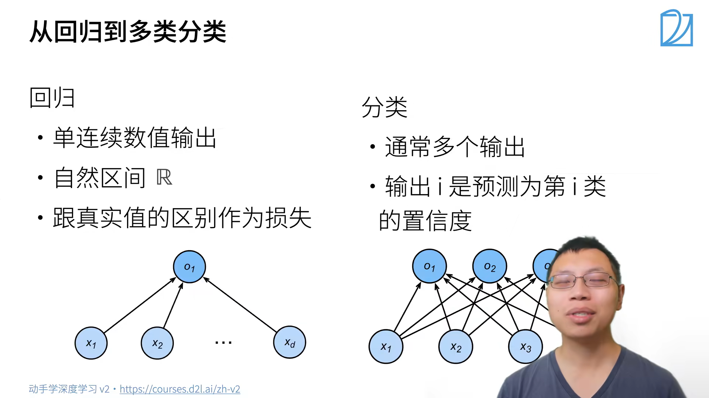

# 动手学深度学习笔记v2 李沐（08-09）
本系列将根据李沐老师发布的动手学深度学习课程，撰写一份便于自身回忆的学习笔记
课程链接如下：https://space.bilibili.com/1567748478/lists/358497?type=series
教科书网址：https://zh-v2.d2l.ai/
## 08 线性回归+基础优化算法
### 网课内容
#### 线性回归
线性回归->基础
房价预测案例

由房价预测模型类推至一般的线性模型

_线性模型可以看作单层的神经网络_
进一步，衡量预估质量

总结
+ 线性回归是对n维输入的加权，外加偏差
+ 使用平方损失衡量预测值和真实值的差异
+ 线性回归有显示解
+ 线性回归可以看做是单层神经网络
#### 基础优化算法

学习率选择上不能太小也不能太大
小批量随机梯度下降是深度学习中更多被采用的

选择批量大小
+ 不能太小：每次计算量太小，不适合并行来最大利用计算资源
+ 不能太大：内存消耗增加，浪费计算，例如如果所有的样本都是相同的
  
总结
+ 梯度下降通过不断沿着反梯度方向更新参数求解
+ 小批量随机梯度下降是深度学习默认的求解算法
+ 两个重要的超参数是**批量大小**和**学习率**
#### 线性回归从零开始实现
该部分从零开始实现了整个方法，包括数据流水线、模型、损失函数和小批量随机梯度下降优化器
该部分详情代码和相关实现见电子教材，此处不进行过多的阐述
#### 线性回归的简洁实现
使用深度学习框架来简洁实现线性回归模型和生成数据集
同上从零开始实现
### 教材内容
回归（regression）是能为一个或多个自变量与因变量之间关系建模的一类方法
线性回归基于几个简单的假设：
+ 假设自变量x和因变量y之间的关系是线性的， 即y可以表示为x中元素的加权和，这里通常允许包含观测值的一些噪声
+ 我们假设任何噪声都比较正常，如噪声遵循正态分布
  

无论我们使用什么手段来观察特征X和标签y， 都可能会出现少量的**观测误差**。因此，即使确信特征与标签的潜在关系是线性的， 我们也会加入一个噪声项来考虑观测误差带来的影响。
在开始寻找最好的模型参数（model parameters）w和b之前， 我们还需要两个东西： 
1. 一种模型质量的度量方式；
2. 一种能够更新模型以提高模型预测质量的方法

**损失函数（loss function）能够量化目标的实际值与预测值之间的差距**。通常我们会选择非负数作为损失，且数值越小表示损失越小，完美预测时的损失为0。 
在训练模型时，我们希望寻找一组参数， 这组参数能最小化在所有训练样本上的总损失
与我们将在本书中所讲到的其他大部分模型不同，线性回归的解可以用一个公式简单地表达出来，这类解叫作**解析解（analytical solution）**
解析解可以进行很好的数学分析，但解析解对问题的限制很严格，导致它无法广泛应用在深度学习里
梯度下降（gradient descent）的方法， 这种方法**几乎可以优化**所有深度学习模型。它通过不断地在损失函数递减的方向上更新参数来降低误差
梯度下降最简单的用法是计算损失函数（数据集中所有样本的损失均值） 关于模型参数的导数（在这里也可以称为梯度）。 但实际中的执行可能会非常慢：因为在每一次更新参数之前，我们必须遍历整个数据集。 因此，我们通常会在每次需要计算更新的时候随机抽取一小批样本， 这种变体叫做小批量随机梯度下降（minibatch stochastic gradient descent）

_**这些可以调整但不在训练过程中更新的参数称为超参数（hyperparameter）**_
**调参（hyperparameter tuning）是选择超参数的过程** 
超参数通常是我们根据训练迭代结果来调整的， 而训练迭代结果是在独立的验证数据集（validation dataset）上评估得到的
即使我们的函数确实是线性的且无噪声，这些估计值也不会使损失函数真正地达到最小值。因为算法会使得损失向最小值缓慢收敛，但却不能在有限的步数内非常精确地达到最小值。
对像深度神经网络这样复杂的模型来说，损失平面上通常包含多个最小值。深度学习实践者很少会去花费大力气寻找这样一组参数，使得在训练集上的损失达到最小。事实上，更难做到的是找到一组参数，这组参数能够在我们从未见过的数据上实现较低的损失， 这一挑战被称为**泛化（generalization）**
在训练我们的模型时，我们经常希望能够同时处理整个小批量的样本。为了实现这一点，需要我们对计算进行矢量化， 从而利用线性代数库，而不是在Python中编写开销高昂的for循环。
_矢量化代码通常会带来数量级的加速_。另外，我们将更多的数学运算放到库中，而无须自己编写那么多的计算，从而减少了出错的可能性。
对噪声分布的假设来解读平方损失目标函数

改变均值会产生沿x轴的偏移，增加方差将会分散分布、降低其峰值
均方误差损失函数（简称均方损失）可以用于线性回归的一个原因是：我们假设了观测中包含噪声，其中 _噪声服从正态分布_ 。 

当今大多数深度学习的研究几乎没有直接从神经科学中获得灵感
线性回归小结
+ 机器学习模型中的关键要素是训练数据、损失函数、优化算法，还有模型本身
+ 矢量化使数学表达上更简洁，同时运行的更快
+ 最小化目标函数和执行极大似然估计等价
+ 线性回归模型也是一个简单的神经网络

我们利用GPU并行运算的优势，处理合理大小的“小批量”。每个样本都可以并行地进行模型计算，且每个样本损失函数的梯度也可以被并行计算。GPU可以在处理几百个样本时，所花费的时间不比处理一个样本时多太多。
线性回归的从零开始实现的流程
生成数据集->读取数据集->初始化模型参数->定义模型->定义损失函数->定义优化算法->训练
在机器学习中，我们通常不太关心恢复真正的参数，而更关心如何高度准确预测参数。幸运的是，即使是在复杂的优化问题上，随机梯度下降通常也能找到非常好的解。其中一个原因是，在深度网络中存在许多参数组合能够实现高度精确的预测
从零实现小结：
+ 我们学习了深度网络是如何实现和优化的。在这一过程中只使用张量和自动微分，不需要定义层或复杂的优化器。
+ 这一节只触及到了表面知识。在下面的部分中，我们将基于刚刚介绍的概念描述其他模型，并学习如何更简洁地实现其他模型。

简洁实现小结：
+ 我们可以使用PyTorch的高级API更简洁地实现模型。
+ 在PyTorch中，data模块提供了数据处理工具，nn模块定义了大量的神经网络层和常见损失函数。
+ 我们可以通过_结尾的方法将参数替换，从而初始化参数。

### 个人感受
在学习了整体的线性回归的基础上，个人对算法所想要实现的目的有了更为清晰的认识，并生出了一些针对性的感慨
+ **看似选取均方误差是一种个性的选取，但实际上线性回归损失函数（均方误差）的概率本质，不再是 “凭空选择”，而是基于假设和数学推导的自然结果**。由此让我引发一种思考，那是否所有的模型的损失函数的选择都是需要基于数学推导？是否都是基于一种理性的选择？如果全部的过程都可以通过数学领域的推导来解决，那么具体层面上来说的黑盒又是如何产生的呢？
+ 整个过程中通过pytorch对代码进行了实现，可在这个过程中，由于基于大模型的依赖，实际上对代码功底的理解缺乏一定更为细节上的认识，甚至缺乏了最基本的耐性，需要警醒和反思
## Softmax回归+损失函数+图片分类数据集
### 网课内容
#### Softmax回归
回归vs分类
+ 回归估计一个连续值
+ 分类预测一个离散类别

对类别进行一位有效编码
使用均方误差
最大值为预测
需要更置信的识别正确类（大余量）

##### 小结
+ Softmax回归是一个多类分类模型
+ 使用Softmax分类子得到每个类的预测置信度
+ 使用交叉熵来衡量预测和标号的区别

#### 损失函数

#### 图片分类数据集和其实现
MNIST数据集
Fashion-MNIST数据集
数据读取的速度和模型训练的速度
Softmax回归的从头实现和简洁实现
### 教材内容
通常，机器学习实践者用分类这个词来描述两个有微妙差别的问题： 
1. 我们只对样本的“硬性”类别感兴趣，即属于哪个类别；
2. 我们希望得到“软性”类别，即得到属于每个类别的概率。 

这两者的界限往往很模糊。其中的一个原因是：即使我们只关心硬类别，我们仍然使用软类别的模型。
统计学家很早以前就发明了一种表示分类数据的简单方法：独热编码（one-hot encoding）。独热编码是一个向量，它的分量和类别一样多。类别对应的分量设置为1，其他所有分量设置为0

然而我们能否将未规范化的预测直接视作我们感兴趣的输出呢？ 答案是否定的。 因为将线性层的输出直接视为概率时存在一些问题： 一方面，我们没有限制这些输出数字的总和为1。 另一方面，根据输入的不同，它们可以为负值。
要将输出视为概率，我们必须保证在任何数据上的输出都是非负的且总和为1。 此外，我们需要一个训练的目标函数，来激励模型精准地估计概率。例如， 在分类器输出0.5的所有样本中，我们希望这些样本是刚好有一半实际上属于预测的类别。这个属性叫做校准（calibration）。

为了提高计算效率并且充分利用GPU，我们通常会对小批量样本的数据执行矢量计算

导数是我们softmax模型分配的概率与实际发生的情况（由独热标签向量表示）之间的差异
信息论的核心思想是量化数据中的信息内容

softmax回归小结
+ softmax运算获取一个向量并将其映射为**概率**。
+ softmax回归适用于分类问题，它使用了softmax运算中输出类别的概率分布。
+ 交叉熵是一个衡量两个概率分布之间差异的很好的度量，它测量给定模型编码数据所需的比特数。

图像分类数据集小结  
+ Fashion-MNIST是一个服装分类数据集，由10个类别的图像组成。我们将在后续章节中使用此数据集来评估各种分类算法。
+ 我们将高度h像素，宽度w像素图像的形状记为h*W或（h,w）。
+ 数据迭代器是获得更高性能的关键组件。依靠实现良好的数据迭代器，利用高性能计算来避免减慢训练过程。
  

矩阵中的非常大或非常小的元素可能造成数值**上溢**或**下溢**
交叉熵损失函数 这可能是深度学习中最常见的损失函数，因为目前分类问题的数量远远超过回归问题的数量。
分类精度即正确预测数量与总预测数量之比。虽然直接优化精度可能很困难（因为精度的计算不可导）， 但精度通常是我们最关心的性能衡量标准，我们在训练分类器时几乎总会关注它。

从零实现小结：
+ 借助softmax回归，我们可以训练多分类的模型。
+ 训练softmax回归循环模型与训练线性回归模型非常相似：先读取数据，再定义模型和损失函数，然后使用优化算法训练模型。大多数常见的深度学习模型都有类似的训练过程。

简洁实现小结：
+ 使用深度学习框架的高级API，我们可以更简洁地实现softmax回归。
+ 从计算的角度来看，实现softmax回归比较复杂。在许多情况下，深度学习框架在这些著名的技巧之外采取了额外的预防措施，来确保数值的稳定性。这使我们避免了在实践中从零开始编写模型时可能遇到的陷阱。
  
### 个人感受
softmax线性回归通过一些函数方面的技巧将数值转换为可以被比较的概率从而实现了对应的功能，在这个过程中实际上牵涉到了诸多方面，其中数值的溢出是一个点，并需要个人去努力认知和实现
对于其中涉及的信息论中的部分内容存在理解上的一定困难，而目前来看是由于对于概率论部分知识掌握存在不足导致的，这更多的还是需要个人去加强弥补的，任重而道远。
