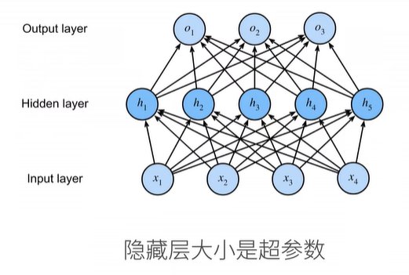

# 动手学深度学习笔记v2 李沐（10-15）
本系列将根据李沐老师发布的动手学深度学习课程，撰写一份便于自身回忆的学习笔记
课程链接如下：https://space.bilibili.com/1567748478/lists/358497?type=series
教科书网址：https://zh-v2.d2l.ai/
## 10 多层感知机+代码实现
### 网课内容
#### 感知机

二分类：-1 或 1
+ Vs.回归输出实数
+ Vs。Softmax回归输出概率

训练感知机

感知机不能拟合XOR函数，它只能产生线性分割面
##### 总结
+ 感知机是一个**二分类模型**，是最早的AI模型之一
+ 他的求解算法等价于使用批量大小为1的梯度下降
+ 他不能拟合XOR函数，导致的*第一次AI寒冬*
#### 多层感知机

单隐藏层

为什么需要非线性的激活函数？因为如若不然，其实际上仍然线性

##### 总结
+ 多层感知机使用隐藏层和激活函数得到非线性模型
+ 常用激活函数是Sigmoid，Tanh，ReLU
+ 使用Softmax来处理多类分类
+ 超参数为隐藏层数，和各个隐藏层大小

#### 代码实现
该部分依旧分为从零实现和简洁实现，详情见课本
### 教材部分
仿射变换中的线性是一个很强的假设
对于深度神经网络，我们使用观测数据来联合学习隐藏层表示和应用于该表示的线性预测器。
具有全连接层的多层感知机的参数开销可能会高得令人望而却步。 即使在不改变输入或输出大小的情况下， 可能在参数节约和模型有效性之间进行权衡
注意在添加隐藏层之后，模型现在需要跟踪和更新额外的参数。 可我们能从中得到什么好处呢？在上面定义的模型里，我们**没有好处**！ 原因很简单：上面的隐藏单元由输入的仿射函数给出，而输出（softmax操作前）只是隐藏单元的仿射函数。仿射函数的仿射函数本身就是仿射函数， 但是我们之前的线性模型已经能够表示任何仿射函数。
为了发挥多层架构的潜力， 我们还需要一个额外的关键要素： 在仿射变换之后对每个隐藏单元应用非线性的**激活函数（activation function）**。 
激活函数的输出被称为活性值（activations）
虽然一个单隐层网络能学习任何函数， 但并不意味着我们应该尝试使用单隐藏层网络来解决所有问题。事实上，通过使用更深（而不是更广）的网络，我们可以更容易地逼近许多函数
激活函数（activation function）通过计算加权和并加上偏置来确定神经元是否应该被激活， 它们将输入信号转换为输出的可微运算。
ReLU函数：当输入为负时，ReLU函数的导数为0，而当输入为正时，ReLU函数的导数为1。注意，当输入值精确等于0时，ReLU函数不可导。 在此时，我们默认使用左侧的导数，即当输入为0时导数为0。 我们可以忽略这种情况，因为输入可能永远都不会是0。这里引用一句古老的谚语，**“如果微妙的边界条件很重要，我们很可能是在研究数学而非工程”**， 这个观点正好适用于这里。
使用ReLU的原因是，它求导表现得特别好：要么让参数消失，要么让参数通过。 这使得优化表现得更好，并且*ReLU减轻了困扰以往神经网络的梯度消失问题*（稍后将详细介绍

与sigmoid函数类似， tanh(双曲正切)函数也能将其输入压缩转换到区间(-1, 1)上
多层感知机部分小结
+ 多层感知机在输出层和输入层之间增加一个或多个全连接隐藏层，并通过激活函数转换隐藏层的输出。
+ 常用的激活函数包括ReLU函数、sigmoid函数和tanh函数。

通常，我们选择2的若干次幂作为层的宽度。 因为内存在硬件中的分配和寻址方式，这么做往往可以在计算上更高效。
多层感知机的从零开始实现小结
+ 手动实现一个简单的多层感知机是很容易的。然而如果有大量的层，从零开始实现多层感知机会变得很麻烦（例如，要命名和记录模型的参数）

多层感知机的简洁实现小结
+ 我们可以使用高级API更简洁地实现多层感知机。
+ 对于相同的分类问题，多层感知机的实现与softmax回归的实现相同，只是多层感知机的实现里增加了带有激活函数的隐藏层。
  
### 个人感受
从感知机到多层感知机，解决问题从线性到非线性，寒冬到如今的蓬勃发，技术的不断发展推进为解决一系列问题提供了可行的方案。
当看到教材上这样一段话时，内心还是不可避免地产生了诸多波澜： **“总结一下，我们现在了解了如何结合非线性函数来构建具有更强表达能力的多层神经网络架构。 顺便说一句，这些知识已经让你掌握了一个类似于1990年左右深度学习从业者的工具。 在某些方面，你比在20世纪90年代工作的任何人都有优势， 因为你可以利用功能强大的开源深度学习框架，只需几行代码就可以快速构建模型， 而以前训练这些网络需要研究人员编写数千行的C或Fortran代码。”** 一方面感慨于知识更新迭代之快，另一方面又在踩在前人肩膀上不断登高的虔诚向往。
## 11 模型选择+过拟合和欠拟合
### 网课内容
#### 模型选择
偿还贷款案例
训练误差：模型在训练数据上的误差
泛化误差：模型在新数据上的误差
验证数据集：一个用来评估模型好坏的数据集
测试数据集：只用一次的数据集

##### 总结
+ 训练数据集：训练模型参数
+ 验证数据集：选择模型超参数
+ 非大数据集上通常使用*k-折交叉验证*
#### 过拟合和欠拟合

模型容量
+ 拟合各种函数的能力
+ 低容量的模型难以拟合训练数据
+ 高容量的模型可以记住所有的训练数据

估计模型容量
难以在不同种类算法之间比较
给定一个模型种类，将有两个*主要因素*
+ 参数的个数
+ 参数值的选择范围

VC维
+ 统计学习理论的一个*核心思想*
+ 对于一个分类模型，VC等于一个最大的数据集的大小，不管如何给定标号，都存在一个模型来对他进行完美分类

VC维的用处
+ 提供为什么一个模型好的理论依据：可以衡量训练误差和泛化误差之间的间隔
+ 但深度学习中很少使用：衡量不是很准确，计算深度学习模型的VC维很困难

数据复杂度
多个重要因素
+ 样本个数
+ 每个样本的元素个数
+ 时间、空间结构
+ 多样性
  
##### 总结
+ 模型容量需要匹配数据复杂度，否则可能导致欠拟合和过拟合
+ 统计机器学习提供数学工具来衡量模型复杂度
+ 实际中一般靠观察训练误差和验证误差

同时提供了代码来进行讲解何为过拟合和欠拟合，详情见教材
### 教材内容
作为机器学习科学家，我们的目标是发现模式（pattern）
我们不想让模型只会做这样的事情：“那是鲍勃！我记得他！他有痴呆症！”。原因很简单：当我们将来部署该模型时，模型需要判断从未见过的患者。**只有当模型真正发现了一种泛化模式时，才会作出有效的预测。**
更正式地说，我们的目标是发现某些模式， 这些模式捕捉到了我们训练集潜在总体的规律。 如果成功做到了这点，即使是对以前从未遇到过的个体， 模型也可以成功地评估风险。 如何发现可以泛化的模式是机器学习的根本问题。
将模型在训练数据上拟合的比在潜在分布中更接近的现象称为过拟合（overfitting）， 用于**对抗过拟合**的技术称为正则化（regularization）
训练误差（training error）是指，模型在训练数据集上计算得到的误差。 
泛化误差（generalization error）是指，模型应用在同样从原始样本的分布中抽取的无限多数据样本时，模型误差的期望。
问题是，我们永远不能准确地计算出泛化误差。这是因为无限多的数据样本是一个虚构的对象。在实际中，我们只能通过将模型应用于一个独立的测试集来估计泛化误差，该测试集由随机选取的、未曾在训练集中出现的数据样本构成。
在我们目前已探讨、并将在之后继续探讨的监督学习情景中， 我们假设训练数据和测试数据都是从相同的分布中独立提取的。 这通常被称为**独立同分布假设（i.i.d. assumption）**， 这意味着对数据进行采样的过程没有进行“记忆”。 换句话说，抽取的第2个样本和第3个样本的相关性， 并不比抽取的第2个样本和第200万个样本的相关性更强。
通常对于神经网络，我们认为需要更多训练迭代的模型比较复杂， 而需要早停（early stopping）的模型（即较少训练迭代周期）就不那么复杂
统计学家认为，能够轻松解释任意事实的模型是复杂的， 而表达能力有限但仍能很好地解释数据的模型可能更有现实用途
如果一个理论能拟合数据，且有具体的测试可以用来证明它是错误的，那么它就是好的。 这一点很重要，因为所有的统计估计都是事后归纳。
几个倾向于影响模型泛化的因素
+ 可调整参数的数量。当可调整参数的数量（有时称为自由度）很大时，模型往往更容易过拟合。
+ 参数采用的值。当权重的取值范围较大时，模型可能更容易过拟合。
+ 训练样本的数量。即使模型很简单，也很容易过拟合只包含一两个样本的数据集。而过拟合一个有数百万个样本的数据集则需要一个极其灵活的模型。
  
在机器学习中，我们通常在评估几个候选模型后选择最终的模型。 这个过程叫做**模型选择**。
解决此问题的常见做法是将我们的数据分成三份，除了训练和测试数据集之外，还增加一个验证数据集（validation dataset），也叫验证集（validation set）。但*现实是验证数据和测试数据之间的边界模糊得令人担忧。*
k折交叉验证
当我们比较训练和验证误差时，我们要注意两种常见的情况。 
+ 首先，我们要注意这样的情况：训练误差和验证误差都很严重， 但它们之间仅有一点差距。 如果模型不能降低训练误差，这可能意味着模型过于简单（即表达能力不足）， 无法捕获试图学习的模式。 此外，由于我们的训练和验证误差之间的泛化误差很小， 我们有理由相信可以用一个更复杂的模型降低训练误差。 这种现象被称为欠拟合（underfitting）。
+ 另一方面，当我们的训练误差明显低于验证误差时要小心， 这表明严重的过拟合（overfitting）。 **注意，过拟合并不总是一件坏事。** 特别是在深度学习领域，众所周知， 最好的预测模型在训练数据上的表现往往比在保留（验证）数据上好得多。 最终，我们通常更关心验证误差，而不是训练误差和验证误差之间的差距。

模型复杂度对欠拟合和过拟合的影响
数据集的大小
从一定程度上来说，深度学习目前的生机要归功于 廉价存储、互联设备以及数字化经济带来的海量数据集。
#### 小结
+ 欠拟合是指模型无法继续减少训练误差。过拟合是指训练误差远小于验证误差。
+ 由于不能基于训练误差来估计泛化误差，因此简单地最小化训练误差并不一定意味着泛化误差的减小。机器学习模型需要注意防止过拟合，即防止泛化误差过大。
+ 验证集可以用于模型选择，但不能过于随意地使用它。
+ 我们应该选择一个复杂度适当的模型，避免使用数量不足的训练样本。

### 个人感受
整个过程之中，过拟合和欠拟合的交错，同时训练误差和泛化误差在模型复杂度下的图像趋势，令人自然联想到了**NFL定理，天下并没有免费的午餐**
**“能够轻松解释任意事实的模型是复杂的， 而表达能力有限但仍能很好地解释数据的模型可能更有现实用途”“如果一个理论能拟合数据，且有具体的测试可以用来证明它是错误的，那么它就是好的。”** 这种 “主动暴露局限” 的特性，在牺牲训练之中的精度的基础上，让简单模型更能被检验、被改进，因此在实际问题中更可靠的思路诚然是一种值得被学习借鉴的思路所在。
## 12 权重衰退
### 网课内容

#### 总结
+ 权重衰退通过L2正则项使模型参数不会过大，从而控制模型复杂度
+ 正则项权重是控制模型复杂度的超参数

代码实现部分依旧是自行查看电子教材
### 教材内容
限制特征的数量是缓解过拟合的一种常用技术
多项式对多变量数据的自然扩展称为单项式（monomials）， 也可以说是变量幂的乘积。单项式的阶数是幂的和
在训练参数化机器学习模型时， 权重衰减（weight decay）是最广泛使用的正则化的技术之一， 它通常也被称为L2正则化。
要保证权重向量比较小， 最常用方法是将其范数作为惩罚项加到最小化损失的问题中。 将原来的训练目标最小化训练标签上的预测损失， 调整为最小化预测损失和惩罚项之和。 

由于权重衰减在神经网络优化中很常用， 深度学习框架为了便于我们使用权重衰减， 将权重衰减集成到优化算法中，以便与任何损失函数结合使用。 此外，这种集成还有计算上的好处， 允许在不增加任何额外的计算开销的情况下向算法中添加权重衰减。 由于更新的权重衰减部分仅依赖于每个参数的当前值， 因此优化器必须至少接触每个参数一次。
#### 小结
+ 正则化是处理过拟合的常用方法：在训练集的损失函数中加入惩罚项，以降低学习到的模型的复杂度。
+ 保持模型简单的一个特别的选择是使用**L2惩罚的权重衰减**。这会导致学习算法更新步骤中的权重衰减。
+ 权重衰减功能在深度学习框架的优化器中提供。
+ 在同一训练代码实现中，不同的参数集可以有不同的更新行为。
### 个人感受
一系列的选择与添加对于目前的我看来实际上更多的带有一种直觉选择的色彩，换而言之，便是其似乎背后总有其逻辑所在，但我对这个部分的逻辑似乎总有不清晰不明朗的地方。
通过技术方法处理过拟合，解决过拟合带来的问题，因而生发了这些方法与技术，在感慨其智慧的同时，更是感到任重而道远，望能起而行之。
## 13 丢弃法
### 网课内容
动机

通常将丢弃法作用在隐藏全连接层的输出上
推理中的丢弃法

#### 总结
+ 丢弃法将一些输出项随机置0来控制模型复杂度
+ 常作用在多层感知机的隐藏层输出上
+ 丢弃概率是控制模型复杂度的超参数

代码实现部分依旧是分成从零实现和简洁实现，具体看电子教材实现
### 教材内容
泛化性和灵活性之间的这种基本权衡被描述为偏差-方差权衡（bias-variance tradeoff）。 线性模型有很高的偏差：它们只能表示一小类函数。 然而，这些模型的方差很低：它们在不同的随机数据样本上可以得出相似的结果。
与线性模型不同，神经网络并不局限于单独查看每个特征，而是学习特征之间的交互。
*深度网络的泛化性质令人费解，而这种泛化性质的数学基础仍然是悬而未决的研究问题。*
我们期待“好”的预测模型能在未知的数据上有很好的表现： 经典泛化理论认为，为了缩小训练和测试性能之间的差距，应该以简单的模型为目标。
简单性的另一个角度是平滑性，即函数不应该对其输入的微小变化敏感。 
1995年，克里斯托弗·毕晓普证明了 具有输入噪声的训练等价于Tikhonov正则化 (Bishop, 1995)。 这项工作用数学证实了“要求函数光滑”和“要求函数对输入的随机噪声具有适应性”之间的联系。
他们建议在计算后续层之前向网络的每一层注入噪声。 因为当训练一个有多层的深层网络时，注入噪声只会在输入-输出映射上增强平滑性
这个想法被称为暂退法（dropout）。 暂退法在前向传播过程中，计算每一内部层的同时注入噪声，这已经成为训练神经网络的常用技术。 这种方法之所以被称为暂退法，因为我们从表面上看是在训练过程中丢弃（drop out）一些神经元。 在整个训练过程的每一次迭代中，标准暂退法包括在计算下一层之前将当前层中的一些节点置零。
一种想法是以一种无偏向（unbiased）的方式注入噪声。 这样在固定住其他层时，每一层的期望值等于没有噪音时的值。

#### 小结
+ 暂退法在前向传播过程中，计算每一内部层的同时丢弃一些神经元。
+ 暂退法可以避免过拟合，它通常与控制权重向量的维数和大小结合使用的。
+ 暂退法将活性值h替换为具有期望值h的随机变量。
+ 暂退法仅在训练期间使用。

### 个人感受
这个过程也是为了处理过拟合带来的影响，而且根据李沐老师所言，其在多层感知机中比权重衰退更常用
从数学到实践的实现是有一定距离和沟壑的，*如何把握和处理这个沟壑*是需要个人去着重思考的问题
## 14 数值稳定性+模型初始化和激活函数
### 网课内容
#### 数值稳定性

两个问题：梯度爆炸、梯度消失

##### 总结
+ 当数值过大或者过小时会导致数值问题
+ 常发生在深度模型中，因为其会对n个数累乘

#### 模型初始化和激活函数
让训练更加稳定
+ 目标：让梯度值在合理的范围内
+ 将乘法变加法
+ 归一化
+ 合理的权重初始和激活函数

##### 总结
+ 合理的权重初始值和激活函数的选取可以提升数值稳定性

### 教材内容
#### 前向传播、反向传播和计算图
前向传播（forward propagation或forward pass） 指的是：按顺序（从输入层到输出层）计算和存储神经网络中每层的结果。

反向传播（backward propagation或backpropagation）指的是计算神经网络参数梯度的方法。 简言之，该方法根据微积分中的链式规则，按相反的顺序从输出层到输入层遍历网络。
在训练神经网络时，前向传播和反向传播相互依赖。 对于前向传播，我们沿着依赖的方向遍历计算图并计算其路径上的所有变量。 然后将这些用于反向传播，其中计算顺序与计算图的相反。
##### 小结
+ 前向传播在神经网络定义的计算图中按顺序计算和存储中间变量，它的顺序是从输入层到输出层。
+ 反向传播按相反的顺序（从输出层到输入层）计算和存储神经网络的中间变量和参数的梯度。
+ 在训练深度学习模型时，前向传播和反向传播是相互依赖的。
+ 训练比预测需要更多的内存。
  
#### 数值稳定性和模型初始化
**初始化方案的选择在神经网络学习中起着举足轻重的作用**， 它对保持数值稳定性至关重要。
不稳定梯度带来的风险不止在于数值表示； 不稳定梯度也威胁到我们优化算法的稳定性。 我们可能面临一些问题。 要么是梯度爆炸（gradient exploding）问题： 参数更新过大，破坏了模型的稳定收敛； 要么是梯度消失（gradient vanishing）问题： 参数更新过小，在每次更新时几乎不会移动，导致模型无法学习。
更稳定的ReLU系列函数已经成为从业者的默认选择（虽然在神经科学的角度看起来不太合理）
神经网络设计中的另一个问题是其参数化所固有的对称性
解决（或至少减轻）上述问题的一种方法是进行参数初始化， 优化期间的注意和适当的正则化也可以进一步提高稳定性。

##### 小结
+ 梯度消失和梯度爆炸是深度网络中常见的问题。在参数初始化时需要非常小心，以确保梯度和参数可以得到很好的控制。
+ 需要用启发式的初始化方法来确保初始梯度既不太大也不太小。
+ ReLU激活函数缓解了梯度消失问题，这样可以加速收敛。
+ 随机初始化是保证在进行优化前打破对称性的关键。
+ Xavier初始化表明，对于每一层，输出的方差不受输入数量的影响，任何梯度的方差不受输出数量的影响。
  
#### 环境和分布偏移
有时，根据测试集的精度衡量，模型表现得非常出色。 但是当数据分布突然改变时，模型在部署中会出现灾难性的失败。 更隐蔽的是，有时模型的部署本身就是扰乱数据分布的催化剂。

概念偏移（concept shift）： 当标签的定义发生变化时，就会出现这种问题。

标签偏移的一个好处是，如果我们在源分布上有一个相当好的模型， 那么我们可以得到对这些权重的一致估计，而不需要处理周边的其他维度。 在深度学习中，输入往往是高维对象（如图像），而标签通常是低维（如类别）。

有了如何处理分布变化的知识，我们现在可以考虑机器学习问题形式化的其他方面。
+ 批量学习（batch learning）中，我们可以访问一组训练特征和标签，我们使用这些特性和标签训练
+ 在线学习
+ 老虎机
+ 控制
+ 强化学习（reinforcement learning）强调如何基于环境而行动，以取得最大化的预期利益。
+ 考虑到环境

##### 小结
+ 在许多情况下，训练集和测试集并不来自同一个分布。这就是所谓的分布偏移。
+ 真实风险是从真实分布中抽取的所有数据的总体损失的预期。然而，这个数据总体通常是无法获得的。经验风险是训练数据的平均损失，用于近似真实风险。在实践中，我们进行经验风险最小化。
+ 在相应的假设条件下，可以在测试时检测并纠正协变量偏移和标签偏移。在测试时，不考虑这种偏移可能会成为问题。
+ 在某些情况下，环境可能会记住自动操作并以令人惊讶的方式做出响应。在构建模型时，我们必须考虑到这种可能性，并继续监控实时系统，并对我们的模型和环境以意想不到的方式纠缠在一起的可能性持开放态度。

### 个人感受
个人感觉在学习这一部分的过程中感受到了较大的阻力因素，具体而言可以总结为以下几点：
+ 在环境和分布偏移部分中，对于各种分布的迁移难以形成一直直观上的认识，缺乏一种本能的数学感知
+ 一系列算法的提出和优化方案的实施，令人在实践之中究竟该通过什么样的方式实现这个过程有了更为困惑的认识，似乎有涯随无涯，难以捉摸
+ 对于教材中的部分内容感到一丝迷茫困惑，涉及到了不少缺乏先验知识的认识，需要更为认真的提高

## 15 实战：Kaggle房价预测 + 课程竞赛：加州2020年房价预测
### 网课内容
kaggle平台上进行预测比较
介绍数据集
具体部分代码讲解部分见电子教材
### 教材内容
Kaggle的房价预测比赛是一个很好的起点。此数据集由Bart de Cock于2011年收集 (De Cock, 2011)， 涵盖了2006-2010年期间亚利桑那州埃姆斯市的房价。 这个数据集是相当通用的，不会需要使用复杂模型架构。
比赛网址：https://www.kaggle.com/c/house-prices-advanced-regression-techniques
每条记录都包括房屋的属性值和属性，如街道类型、施工年份、屋顶类型、地下室状况等。 这些特征由各种数据类型组成。
+ 访问和读取数据集
+ 数据预处理
+ 训练
+ k折交叉验证
+ 模型选择
+ 提交Kaggle预测

#### 小结
+ 真实数据通常混合了不同的数据类型，需要进行预处理。
+ 常用的预处理方法：将实值数据重新缩放为零均值和单位方法；用均值替换缺失值。
+ 将类别特征转化为指标特征，可以使我们把这个特征当作一个独热向量来对待。
+ 我们可以使用K折交叉验证来选择模型并调整超参数。
+ 对数对于相对误差很有用。

### 个人感受
整个过程对前面的所学进行了一次灵活实践，类似于一场现实考试
在观察到排行榜上的成绩后更是感慨万千