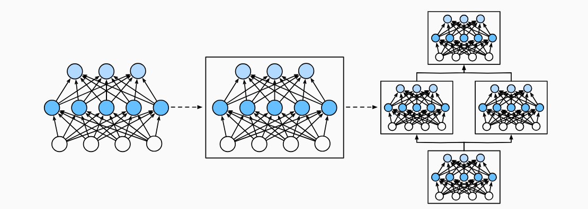
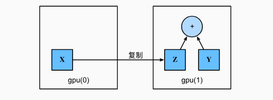
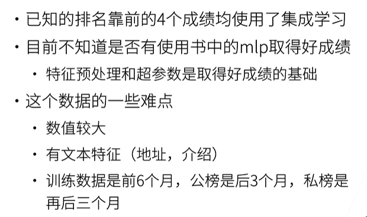
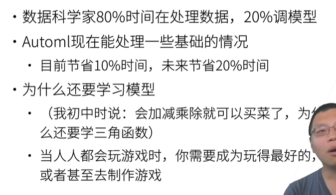

# 动手学深度学习笔记v2 李沐（16-18）
本系列将根据李沐老师发布的动手学深度学习课程，撰写一份便于自身回忆的学习笔记
课程链接如下：https://space.bilibili.com/1567748478/lists/358497?type=series
教科书网址：https://zh-v2.d2l.ai/
## 16 PyTorch 神经网络基础
### 网课内容
自定义块：灵活定义
参数管理
自定义层
读写文件
### 教材内容
#### 层和快
单个神经网络 （1）接受一些输入； （2）生成相应的标量输出； （3）具有一组相关 参数（parameters），更新这些参数可以优化某目标函数。
当考虑具有多个输出的网络时， 我们利用矢量化算法来描述整层神经元。 像单个神经元一样，层（1）接受一组输入， （2）生成相应的输出， （3）由一组可调整参数描述。 
为了实现这些复杂的网络，我们引入了神经网络块的概念。 块（block）可以描述单个层、由多个层组成的组件或整个模型本身。 使用块进行抽象的一个好处是可以将一些块组合成更大的组件， 这一过程通常是递归的

从编程的角度来看，块由类（class）表示。 它的任何子类都必须定义一个将其输入转换为输出的前向传播函数， 并且必须存储任何必需的参数。
在实现我们自定义块之前，我们简要总结一下每个块必须提供的基本功能。
1. 将输入数据作为其前向传播函数的参数。
2. 通过前向传播函数来生成输出。请注意，输出的形状可能与输入的形状不同。例如，我们上面模型中的第一个全连接的层接收一个20维的输入，但是返回一个维度为256的输出。
3. 计算其输出关于输入的梯度，可通过其反向传播函数进行访问。通常这是自动发生的。
4. 存储和访问前向传播计算所需的参数。
5. 根据需要初始化模型参数。
   
块的一个主要优点是它的**多功能性**。 我们可以子类化块以创建层（如全连接层的类）、 整个模型（如上面的MLP类）或具有中等复杂度的各种组件
为了构建我们自己的简化的MySequential， 我们只需要定义两个关键函数：
1. 一种将块逐个追加到列表中的函数；
2. 一种前向传播函数，用于将输入按追加块的顺序传递给块组成的“链条”。

简而言之，_modules的主要优点是： 在模块的参数初始化过程中， 系统知道在_modules字典中查找需要初始化参数的子块。
然而，有时我们可能希望合并既不是上一层的结果也不是可更新参数的项， 我们称之为常数参数（constant parameter）
##### 小结
+ 一个块可以由许多层组成；一个块可以由许多块组成。
+ 块可以包含代码。
+ 块负责大量的内部处理，包括参数初始化和反向传播。
+ 层和块的顺序连接由Sequential块处理。

#### 参数管理
介绍以下内容：
+ 访问参数，用于调试、诊断和可视化；
+ 参数初始化；
+ 在不同模型组件间共享参数。

##### 小结
+ 我们有几种方法可以访问、初始化和绑定模型参数。
+ 我们可以使用自定义初始化方法。
  
#### 延后初始化
到目前为止，我们忽略了建立网络时需要做的以下这些事情：
+ 我们定义了网络架构，但没有指定输入维度。
+ 我们添加层时没有指定前一层的输出维度。
+ 我们在初始化参数时，甚至没有足够的信息来确定模型应该包含多少参数。

这里的诀窍是框架的延后初始化（defers initialization）， 即直到数据第一次通过模型传递时，框架才会动态地推断出每个层的大小。
##### 小结
+ 延后初始化使框架能够自动推断参数形状，使修改模型架构变得容易，避免了一些常见的错误。
+ 我们可以通过模型传递数据，使框架最终初始化参数。
  
#### 自定义层
**深度学习成功背后的一个因素是神经网络的灵活性： 我们可以用创造性的方式组合不同的层，从而设计出适用于各种任务的架构。**
##### 小结
+ 我们可以通过基本层类设计自定义层。这允许我们定义灵活的新层，其行为与深度学习框架中的任何现有层不同。
+ 在自定义层定义完成后，我们就可以在任意环境和网络架构中调用该自定义层。
+ 层可以有局部参数，这些参数可以通过内置函数创建。
  
#### 读写文件
此外，当运行一个耗时较长的训练过程时， 最佳的做法是定期保存中间结果， 以确保在服务器电源被不小心断掉时，我们不会损失几天的计算结果。
##### 小结
+ save和load函数可用于张量对象的文件读写。
+ 我们可以通过参数字典保存和加载网络的全部参数。
+ 保存架构必须在代码中完成，而不是在参数中完成。
  
### 个人感受
+ 该部分详细介绍了pytorch在深度学习领域的一些操作方法，由此我生出了一些疑问，深度学习框架中不止有pytorch，与此同时的还有一系列MXNET之类的框架，那为了能够让工程能够落地，我需要做到全部了解这部分吗？需要记忆这一系列的操作吗？尤其是在当下ai发展的今天。
+ 从 **“我们可以用创造性的方式组合不同的层，从而设计出适用于各种任务的架构”** 这句话让我感受到了李沐老师在课程开始所讲述的神经网络是一种语言这句话的含义和内涵所在

## 17 使用和购买 GPU
### 网课内容
需要指定使用GPU
同一个GPU上进行运算
显存效率
### 教材内容
简而言之，自2000年以来，GPU性能每十年增长1000倍
如果我们要计算X + Y，我们需要决定在哪里执行这个操作。 

人们使用GPU来进行机器学习，因为单个GPU相对运行速度快。 但是在设备（CPU、GPU和其他机器）之间传输数据比计算慢得多。 这也使得并行化变得更加困难，因为我们必须等待数据被发送（或者接收）， 然后才能继续进行更多的操作。 这就是为什么拷贝操作要格外小心。 
根据经验，多个小操作比一个大操作糟糕得多。 
#### 小结
+ 我们可以指定用于存储和计算的设备，例如CPU或GPU。默认情况下，数据在主内存中创建，然后使用CPU进行计算。
+ 深度学习框架要求计算的所有输入数据都在同一设备上，无论是CPU还是GPU。
+ 不经意地移动数据可能会显著降低性能。一个典型的错误如下：计算GPU上每个小批量的损失，并在命令行中将其报告给用户（或将其记录在NumPy ndarray中）时，将触发全局解释器锁，从而使所有GPU阻塞。最好是为GPU内部的日志分配内存，并且只移动较大的日志。

### 个人感受
了解硬件GPU的使用毅然是工程实践中必不可缺的一步
作为一名“非计算机科班”出身的我，需要去补充一些计算机领域相关的知识来提高自身对于更多细节上的认识吗？如果真的是投身于这个行业当中去
## 18 预测房价竞赛总结
### 网课内容
方法总结
+ 第二和第七：autogluon
+ 第三：h2o
+ 第四：随机森林

### 教材内容
教材内容见第15部分
### 个人感受
公榜和私榜排名上的不同更加加深了我自身对于整个领域调参的认知和NFL定理的了解，同时也更是生发了引起局部成功的案例并不一定能在更远或者更近的局部取得更为有益的结果
我们是否都在追寻着过拟合这么一个过程？