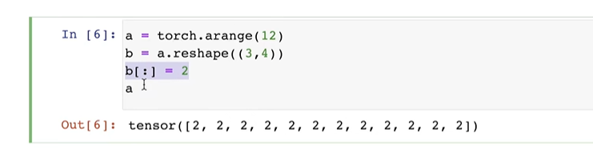
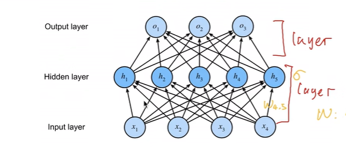

# 动手学深度学习笔记v2 李沐（QA0-18）
本系列将根据李沐老师发布的动手学深度学习课程，撰写一份便于自身回忆的学习笔记
课程链接如下：https://space.bilibili.com/1567748478/lists/358497?type=series
教科书网址：https://zh-v2.d2l.ai/
## 00-01 预告-课程安排
该部分并没有QA环节，故不作记录
同时我需要明确的一点是并不会全部记录下所有的QA，而是选择性地记录下 _个人有所想法_ 的QA
## 02 深度学习介绍
深度学习的可解释性和复杂的机器学习的可解释性仍然是一个学术问题
无人驾驶部分的简单介绍 模型的融合
## 03 安装
一些配置环境安装的基本提问
## 04 数据操作 + 数据预处理
reshape操作过程并不会改变其地址

可以主动学习numpy
## 05 线性代数
统计关于张量的传递
很多框架选谁的问题：工具的问题，工具和学习应该是分开的，类似开车，**学会的应该是开车而不是纠结于开什么车**
尽量讲why，但是并不保证正确
## 06 矩阵计算
凸函数可以得到最优
提及p和np问题
## 07 自动求导
使用过程中显示构造麻烦很多
计算梯度很贵的事情
## 08 线性回归 + 基础优化算法
平方损失和绝对差值问题不大
损失要求平均实际上问题不大，如若里面没有除以N那么学习率除以N一样
最小化损失才是目标 用n-1和用n实际上是类似的
batchsize小可能是好的，引入噪音
二阶导很难算
实际编写代码过程中需要考虑内存
算力支持的情况下多进行epoch可以
## 09 Softmax 回归 + 损失函数 + 图片分类数据集
指数函数拟合0、1这种极限数时存在一定的条件和限制，因此会有一些处理方案
有些时候会关心不正确类
深度学习与统计
微调学习率等处理过拟合等现象
pytorch文档中查看对应的一些操作
统计学习中可以了解到对应的一些模型的可解释性
## 10 多层感知机 + 代码实现
神经网络的层中不认为算输入层（或者输出层），所以下方图片中认为有两层（两个w）

深度学习比浅度学习更好训练，就像是由浅入深，更容易找到一个更好的解
激活函数的本质引入非线性
理论上深度和宽度一样但是实际上深度一般更好一些
训练完参数需要固定（黑人分辨成猩猩的危险案例）
## 11 模型选择 + 过拟合和欠拟合
**神经网络优点是一种语言，比较灵活的框架**
验证集和训练集中的数据处理
k则交叉验证在深度学习中运用较小，因为数据集太大
发展的观点
一些开始提出的好的论文他设计的理由也可能是错误的
模型的统计的模型
很多question聚焦于数据集的处理和设置
## 12 权重衰退
学习一般难以到达最优解，存在噪音
L2往回拉 前提是overfitting
## 13 丢弃法
dropout随机置零时梯度也会归零
简单理解为正则项（dropout）
机器学习没有正确性
神经网络的可重复性一直都是一个难点
随机性可以认为平滑
丢弃法是训练中丢弃，预测时并没有
dropout更好调参
## 14 数值稳定性 + 模型初始化和激活函数
数学可以近似认知为你的理解能力（尽管深度学习要求没有那么高，但是学习数学依旧是必要的）
乘法变加法更加稳定
数值实际上区间，并不影响表达性
均值方差做限制
## 15 实战：Kaggle房价预测 + 课程竞赛：加州2020年房价预测
网络本身也是一个超参数
## 16 PyTorch 神经网络基础
注意处理一些数据的方法从而规避内存爆炸
初始化一般不太会影响最后的输出（只要正常的话）
碰到不可导的函数的概率极低
## 17 使用和购买 GPU
显存自然越大越好
使用GPU温度注意
## 18 预测房价竞赛总结
难以预测未来市场的需求和
竞赛调参重要 实际工作中实际上调参并没有这么重要
首先拼数据，接着拼模型
**随机梯度下降的人生**
## 个人想法
实际上，当个人学完前面0-18这段近似于深度学习基础部分的时候，整个人更多的时候是处在一种茫然无措的状态，或许是来自对于近乎无穷的模型方案的无措，或许是对前人知识的一种拜服，或许是对个人自身能力的一种怀疑？（毕竟诚然浪费的大量的时间，数理、程序基础方面有必然的不足）
观看完这段基础part的QA后，个人在精神世界上诚然是能感受到一丝或多或少的满足与共鸣，恰有一种“后人必将有感于斯文”的感受吧
同时，回过头去，抛开一些数理层面的技法不谈，真正令个人得以洒脱，以致于趋近于豁达的，还是那 **“发展”** 和 **“随机梯度下降的人生”**
+ 发展才是必然的过程，这个过程中不该拘泥于对工具和载体的选择，而是应该真正意义上提高自身对抗风险的能力
+ 或许追寻的、预先设想的目标，本身便只是局部最优解，因此开始做，start远比schedule要更具有价值，知行合一方知前路何方

最后，用八个字来总结：“道阻且长，行则降至”